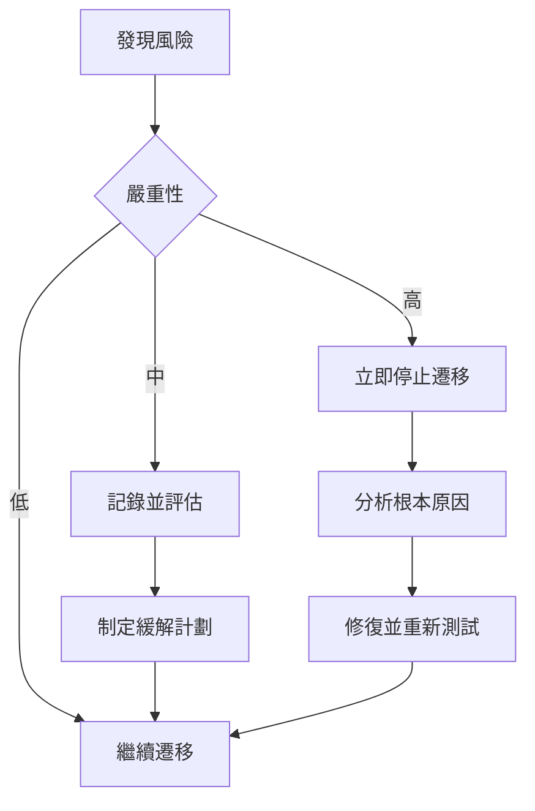

# Laravel 遷移計劃

**專案**: YAMU 業務員推廣系統 - CodeIgniter 4 to Laravel 11
**遷移類型**: 架構遷移 (Framework Migration)
**版本**: v2.0.0 (Breaking Changes)
**計劃日期**: 2026-01-09
**預估時間**: 3-4 週

---

## 📋 目錄

1. [執行摘要](#執行摘要)
2. [現有架構分析](#現有架構分析)
3. [Laravel 目標架構](#laravel-目標架構)
4. [遷移模組規劃](#遷移模組規劃)
5. [API 兼容性策略](#api-兼容性策略)
6. [測試策略](#測試策略)
7. [風險評估](#風險評估)
8. [時程規劃](#時程規劃)

---

## 🎯 執行摘要

### 遷移目標

將現有的 CodeIgniter 4 後端架構遷移至 Laravel 11，提升代碼質量、可維護性和開發效率，同時**保持 API 完全向後兼容**，確保前端無需修改。

### 核心原則

1. **API 兼容性**: 100% 保持 API 端點、Request/Response 格式不變
2. **漸進式遷移**: 按模組逐步遷移，每個模組獨立測試
3. **代碼質量**: 遵循 PHP Pro Skill 標準（PHP 8.3+, Strict Types, PHPStan Level 9）
4. **測試優先**: 每個模組達到 80%+ 測試覆蓋率
5. **零停機**: 使用藍綠部署，確保服務不中斷

### 關鍵指標

| 指標 | 現狀 (CI4) | 目標 (Laravel) |
|------|-----------|----------------|
| PHP 版本 | 8.1+ | 8.3+ |
| 測試覆蓋率 | ~0% | ≥80% |
| 靜態分析 | 無 | PHPStan Level 9 |
| API 端點 | 35 個 | 35 個（兼容） |
| 資料表 | 8 個 | 8 個（相同結構） |
| 架構模式 | MVC | Service Layer + Repository |

---

## 🔍 現有架構分析 (CodeIgniter 4)

### 專案結構

```
my_profile_ci4/
├── app/
│   ├── Controllers/Api/        # 4 個主要 Controllers
│   │   ├── AuthController.php      (12 KB, ~400 lines)
│   │   ├── SearchController.php    (5.7 KB, ~200 lines)
│   │   ├── SalespersonController.php (11 KB, ~400 lines)
│   │   └── AdminController.php     (14 KB, ~500 lines)
│   ├── Models/                 # 12 個 Models
│   │   ├── UserModel.php
│   │   ├── SalespersonProfileModel.php
│   │   ├── CompanyModel.php
│   │   ├── CertificationModel.php
│   │   ├── ExperienceModel.php
│   │   ├── IndustryModel.php
│   │   ├── RegionModel.php
│   │   └── ApprovalLogModel.php
│   ├── Filters/                # 2 個 Filters
│   │   ├── AuthFilter.php      # JWT 驗證
│   │   └── RoleFilter.php      # RBAC 權限檢查
│   └── Database/
│       ├── Migrations/         # 15 個 Migrations
│       └── Seeds/              # 2 個 Seeders
└── vendor/
    └── firebase/php-jwt        # JWT 認證庫
```

### API 模組分析

#### 1. Authentication Module (4 endpoints)
- `POST /auth/register` - 業務員註冊
- `POST /auth/login` - 用戶登入
- `POST /auth/refresh` - Token 刷新
- `GET /auth/me` - 取得當前用戶資訊

**技術細節**:
- JWT Token: Access Token (1hr) + Refresh Token (7 days)
- 密碼加密: bcrypt
- 註冊流程: 創建 user + salesperson_profile，狀態為 `pending`

#### 2. Search Module (2 endpoints - Public)
- `GET /search/salespersons` - 搜尋業務員（分頁、篩選）
- `GET /search/salespersons/:id` - 取得業務員詳情

**技術細節**:
- 公開 API，無需認證
- 支援關鍵字搜尋、公司篩選、產業篩選、地區篩選
- 分頁支援 (page, per_page)

#### 3. Salesperson Module (10 endpoints)
- `GET /salesperson/profile` - 取得個人資料
- `PUT /salesperson/profile` - 更新個人資料
- `POST /salesperson/company` - 提交公司資訊（需審核）
- `GET /salesperson/companies` - 取得公司列表
- `GET /salesperson/experiences` - 取得工作經歷
- `POST /salesperson/experiences` - 新增工作經歷
- `PUT /salesperson/experiences/:id` - 更新工作經歷
- `DELETE /salesperson/experiences/:id` - 刪除工作經歷
- `POST /salesperson/certifications` - 上傳證照（需審核）
- `GET /salesperson/approval-status` - 查詢審核狀態

**技術細節**:
- 需要 JWT 認證 + `salesperson` 角色
- 審核邏輯: Avatar 上傳觸發重新審核，一般資料更新不觸發
- BLOB 存儲: Avatar, Certification files

#### 4. Admin Module (19 endpoints)
- 待審核管理 (7 endpoints)
  - `GET /admin/pending-approvals` - 取得所有待審核項目
  - `POST /admin/approve-user/:id` - 審核通過用戶
  - `POST /admin/reject-user/:id` - 拒絕用戶
  - `POST /admin/approve-profile/:id` - 審核通過 Profile
  - `POST /admin/approve-company/:id` - 審核通過公司
  - `POST /admin/approve-certification/:id` - 審核通過證照
  - `POST /admin/reject-*/:id` - 拒絕各類審核

- 用戶管理 (5 endpoints)
  - `GET /admin/users` - 用戶列表（支援篩選）
  - `GET /admin/users/:id` - 用戶詳情
  - `PUT /admin/users/:id/status` - 更新用戶狀態
  - `DELETE /admin/users/:id` - 軟刪除用戶
  - `GET /admin/statistics` - 平台統計數據

- 系統設定 (7 endpoints)
  - `GET /admin/settings/industries` - 產業列表
  - `POST /admin/settings/industries` - 新增產業
  - `PUT /admin/settings/industries/:id` - 更新產業
  - `DELETE /admin/settings/industries/:id` - 刪除產業
  - `GET /admin/settings/regions` - 地區列表
  - `POST /admin/settings/regions` - 新增地區
  - ...

**技術細節**:
- 需要 JWT 認證 + `admin` 角色
- 審核流程: 記錄 approval_logs
- 統計數據: 聚合查詢

### 資料庫架構

#### Core Tables (5 個)

1. **users** - 用戶帳號
   - 3 種角色: admin, salesperson, user
   - 3 種狀態: pending, active, inactive
   - JWT Token 不存儲在資料庫（無 sessions 表）

2. **salesperson_profiles** - 業務員資料
   - 關聯 user_id, company_id
   - BLOB 存儲: avatar_data (max 16MB)
   - JSON 字段: service_regions
   - 審核狀態: pending, approved, rejected

3. **companies** - 公司資訊（機敏資料）
   - 統一編號 (tax_id): 8位數，unique
   - 需要審核
   - 關聯 industry_id

4. **certifications** - 證照（機敏資料）
   - BLOB 存儲: file_data (max 5MB)
   - 支援格式: JPG, PNG, PDF
   - 需要審核

5. **experiences** - 工作經歷
   - 預設 approved，無需審核
   - sort_order 支援排序

#### System Tables (3 個)

6. **industries** - 產業類別
   - 系統預設 10 個產業
   - Admin 可管理

7. **regions** - 服務地區
   - 系統預設 22 個縣市
   - Admin 可管理

8. **approval_logs** - 審核記錄
   - 記錄所有審核操作
   - 支援 rejected_reason

### 認證與授權

#### JWT 認證流程
```
1. 登入 → 產生 Access Token (1hr) + Refresh Token (7 days)
2. API 請求 → Header: Authorization: Bearer <access_token>
3. AuthFilter → 驗證 JWT, 解碼 payload, 載入 user
4. RoleFilter → 檢查 user.role
5. Token 過期 → 使用 Refresh Token 更新
```

#### 角色權限 (RBAC)
- **admin**: 完整系統管理權限
- **salesperson**: 管理自己的資料和檔案
- **user**: 僅查詢公開資料（目前未實作）

### 技術棧

| 類別 | 技術 | 版本 |
|------|------|------|
| Framework | CodeIgniter 4 | 4.6.4 |
| PHP | PHP | 8.1+ |
| Database | MySQL | 8.0 |
| Authentication | firebase/php-jwt | ^6.0 |
| Deployment | Docker Compose | - |
| Web Server | Apache | - |

### 優點與限制

**優點** ✅:
- API 設計清晰，符合 RESTful
- JWT 認證實作完整
- 審核流程邏輯完整
- Docker 化部署

**限制** ⚠️:
- 缺少 Service Layer，業務邏輯在 Controller
- 沒有 Repository Pattern
- 沒有單元測試
- 沒有靜態分析工具
- 缺少類型聲明
- 缺少依賴注入容器

---

## 🏗️ Laravel 目標架構

### 專案結構 (Laravel 11)

```
my_profile_laravel/
├── app/
│   ├── Http/
│   │   ├── Controllers/Api/        # Thin Controllers
│   │   │   ├── AuthController.php
│   │   │   ├── SearchController.php
│   │   │   ├── SalespersonController.php
│   │   │   └── AdminController.php
│   │   ├── Middleware/
│   │   │   ├── JWTAuthenticate.php
│   │   │   └── CheckRole.php
│   │   ├── Requests/               # Form Requests (Validation)
│   │   │   ├── Auth/
│   │   │   ├── Salesperson/
│   │   │   └── Admin/
│   │   └── Resources/              # API Resources (Response Format)
│   │       ├── UserResource.php
│   │       ├── SalespersonResource.php
│   │       └── ...
│   ├── Services/                   # Business Logic Layer ⭐
│   │   ├── AuthService.php
│   │   ├── SalespersonService.php
│   │   ├── ApprovalService.php
│   │   └── SearchService.php
│   ├── Repositories/               # Data Access Layer ⭐
│   │   ├── UserRepository.php
│   │   ├── SalespersonProfileRepository.php
│   │   ├── CompanyRepository.php
│   │   └── ...
│   ├── Models/                     # Eloquent Models
│   │   ├── User.php
│   │   ├── SalespersonProfile.php
│   │   ├── Company.php
│   │   └── ...
│   ├── Policies/                   # Authorization Policies ⭐
│   │   ├── SalespersonPolicy.php
│   │   └── AdminPolicy.php
│   └── Exceptions/                 # Custom Exceptions
│       ├── UnauthorizedException.php
│       └── ValidationException.php
├── database/
│   ├── migrations/                 # 複製 CI4 Migrations
│   ├── factories/                  # Model Factories (Testing)
│   └── seeders/
├── routes/
│   └── api.php                     # API 路由定義
├── tests/
│   ├── Feature/                    # API 測試
│   │   ├── AuthTest.php
│   │   ├── SalespersonTest.php
│   │   └── AdminTest.php
│   └── Unit/                       # 單元測試
│       ├── Services/
│       └── Repositories/
├── config/
│   ├── auth.php                    # JWT 配置
│   ├── cors.php                    # CORS 配置
│   └── jwt.php                     # tymon/jwt-auth 配置
└── composer.json
```

### 核心套件

```json
{
  "require": {
    "php": "^8.3",
    "laravel/framework": "^11.0",
    "tymon/jwt-auth": "^2.0",          // JWT 認證
    "spatie/laravel-query-builder": "^5.0",  // 進階查詢
    "league/fractal": "^0.20"          // API 轉換層
  },
  "require-dev": {
    "phpstan/phpstan": "^1.10",        // 靜態分析
    "phpunit/phpunit": "^11.0",        // 單元測試
    "pestphp/pest": "^2.0",            // 現代測試框架
    "larastan/larastan": "^2.0"        // Laravel PHPStan
  }
}
```

### 架構模式

#### 1. Service Layer Pattern

**目的**: 封裝業務邏輯，使 Controller 保持精簡

```php
// app/Services/AuthService.php
<?php

declare(strict_types=1);

namespace App\Services;

use App\Models\User;
use App\Repositories\UserRepository;
use Illuminate\Support\Facades\Hash;

final readonly class AuthService
{
    public function __construct(
        private UserRepository $userRepository,
        private JWTService $jwtService
    ) {}

    /**
     * 註冊業務員
     */
    public function register(array $data): User
    {
        // Business logic
        $data['password'] = Hash::make($data['password']);
        $data['role'] = 'salesperson';
        $data['status'] = 'pending';

        return $this->userRepository->create($data);
    }

    /**
     * 登入
     */
    public function login(string $email, string $password): array
    {
        $user = $this->userRepository->findByEmail($email);

        if (!$user || !Hash::check($password, $user->password)) {
            throw new UnauthorizedException('Invalid credentials');
        }

        return $this->jwtService->generateTokens($user);
    }
}
```

#### 2. Repository Pattern

**目的**: 抽象數據訪問層，方便測試和維護

```php
// app/Repositories/UserRepository.php
<?php

declare(strict_types=1);

namespace App\Repositories;

use App\Models\User;
use Illuminate\Database\Eloquent\Collection;

final readonly class UserRepository
{
    public function findByEmail(string $email): ?User
    {
        return User::where('email', $email)->first();
    }

    public function findPendingSalespersons(): Collection
    {
        return User::where('role', 'salesperson')
            ->where('status', 'pending')
            ->get();
    }

    public function updateStatus(int $userId, string $status): bool
    {
        return User::where('id', $userId)
            ->update(['status' => $status]);
    }
}
```

#### 3. Form Request Validation

**目的**: 集中驗證邏輯，保持 Controller 乾淨

```php
// app/Http/Requests/Auth/RegisterRequest.php
<?php

declare(strict_types=1);

namespace App\Http\Requests\Auth;

use Illuminate\Foundation\Http\FormRequest;

final class RegisterRequest extends FormRequest
{
    public function rules(): array
    {
        return [
            'username' => ['required', 'string', 'min:3', 'max:50', 'unique:users'],
            'email' => ['required', 'email', 'unique:users'],
            'password' => ['required', 'string', 'min:8'],
            'full_name' => ['required', 'string', 'min:2', 'max:100'],
            'phone' => ['nullable', 'regex:/^09\d{8}$/'],
            'bio' => ['nullable', 'string'],
        ];
    }
}
```

#### 4. API Resources (Response Formatting)

**目的**: 統一 API 回應格式，保持與 CI4 兼容

```php
// app/Http/Resources/UserResource.php
<?php

declare(strict_types=1);

namespace App\Http\Resources;

use Illuminate\Http\Resources\Json\JsonResource;

final class UserResource extends JsonResource
{
    public function toArray($request): array
    {
        return [
            'id' => $this->id,
            'username' => $this->username,
            'email' => $this->email,
            'role' => $this->role,
            'status' => $this->status,
        ];
    }
}
```

### 技術標準 (PHP Pro Skill)

遵循 `.claude/skills/php-pro/SKILL.md` 標準：

#### 1. Strict Types
```php
<?php

declare(strict_types=1);

// All files must declare strict types
```

#### 2. Type Declarations
```php
// Return type declarations
public function findUser(int $id): ?User { }

// Property type hints
private readonly UserRepository $userRepository;

// Union types
public function process(User|Admin $entity): void { }
```

#### 3. Readonly Properties
```php
final readonly class AuthService
{
    public function __construct(
        private readonly UserRepository $userRepository,
        private readonly JWTService $jwtService
    ) {}
}
```

#### 4. Enums
```php
enum UserRole: string
{
    case ADMIN = 'admin';
    case SALESPERSON = 'salesperson';
    case USER = 'user';
}

enum ApprovalStatus: string
{
    case PENDING = 'pending';
    case APPROVED = 'approved';
    case REJECTED = 'rejected';
}
```

#### 5. PHPStan Level 9
```bash
# phpstan.neon
parameters:
    level: 9
    paths:
        - app
        - tests
```

---

## 🗺️ 遷移模組規劃

### 模組概覽

遷移按照依賴順序拆分為 **7 個獨立模組**，每個模組獨立開發、測試、審查和合併。

```
Module 01: Project Setup (基礎設置)
    ↓
Module 02: Database Layer (資料層)
    ↓
Module 03: Auth Module (認證模組)
    ↓
Module 04: API Endpoints (API 端點)
    ↓
Module 05: Business Logic (業務邏輯)
    ↓
Module 06: Testing (測試)
    ↓
Module 07: Deployment (部署)
```

---

### Module 01: Project Setup (基礎設置)

**時程**: 2-3 天
**Git 分支**: `migration/laravel/01-project-setup`

#### 目標
建立 Laravel 11 專案基礎架構，配置開發環境。

#### 任務清單

1. **建立 Laravel 專案**
   ```bash
   composer create-project laravel/laravel my_profile_laravel
   cd my_profile_laravel
   ```

2. **安裝核心套件**
   ```bash
   composer require tymon/jwt-auth
   composer require spatie/laravel-query-builder
   composer require --dev phpstan/phpstan
   composer require --dev larastan/larastan
   composer require --dev pestphp/pest
   ```

3. **配置環境變數**
   - 複製 `.env.example` → `.env`
   - 配置資料庫連接（使用不同 port，避免與 CI4 衝突）
   ```env
   DB_CONNECTION=mysql
   DB_HOST=127.0.0.1
   DB_PORT=3307  # CI4 使用 3306
   DB_DATABASE=my_profile_laravel
   DB_USERNAME=root
   DB_PASSWORD=123456
   ```

4. **建立 Docker 環境**
   ```yaml
   # docker-compose.yml
   version: '3.8'
   services:
     app:
       build: .
       ports:
         - "8081:80"  # Laravel on 8081, CI4 on 8080
       volumes:
         - .:/var/www/html

     db:
       image: mysql:8.0
       ports:
         - "3307:3306"  # 避免與 CI4 衝突
       environment:
         MYSQL_DATABASE: my_profile_laravel
         MYSQL_ROOT_PASSWORD: 123456
   ```

5. **配置 JWT**
   ```bash
   php artisan vendor:publish --provider="Tymon\JWTAuth\Providers\LaravelServiceProvider"
   php artisan jwt:secret
   ```

6. **配置 CORS**
   ```php
   // config/cors.php
   'allowed_origins' => [
       'http://localhost:3000',  // Next.js
       'http://localhost:5173',
   ],
   ```

7. **建立專案結構**
   ```bash
   mkdir -p app/Services
   mkdir -p app/Repositories
   mkdir -p app/Policies
   mkdir -p app/Http/Requests/Auth
   mkdir -p app/Http/Requests/Salesperson
   mkdir -p app/Http/Requests/Admin
   mkdir -p app/Http/Resources
   ```

8. **配置 PHPStan**
   ```neon
   # phpstan.neon
   parameters:
       level: 9
       paths:
           - app
       excludePaths:
           - vendor
   ```

9. **配置 Pest**
   ```bash
   php artisan pest:install
   ```

#### 驗收標準
- ✅ Laravel 專案可正常啟動
- ✅ Docker 容器運行正常
- ✅ PHPStan Level 9 檢查通過
- ✅ 所有套件安裝完成
- ✅ 環境變數配置正確

---

### Module 02: Database Layer (資料層)

**時程**: 3-4 天
**Git 分支**: `migration/laravel/02-database-layer`

#### 目標
複製 CI4 的資料庫結構到 Laravel，建立 Eloquent Models。

#### 任務清單

1. **複製 Migrations**
   - 從 CI4 `app/Database/Migrations/` 複製到 Laravel
   - 轉換為 Laravel Migration 語法
   - 保持資料表結構完全一致

2. **建立 Eloquent Models** (8 個)
   ```bash
   php artisan make:model User
   php artisan make:model SalespersonProfile
   php artisan make:model Company
   php artisan make:model Certification
   php artisan make:model Experience
   php artisan make:model Industry
   php artisan make:model Region
   php artisan make:model ApprovalLog
   ```

3. **定義 Model 關聯**
   ```php
   // User.php
   public function salespersonProfile(): HasOne
   {
       return $this->hasOne(SalespersonProfile::class);
   }

   public function experiences(): HasMany
   {
       return $this->hasMany(Experience::class);
   }
   ```

4. **建立 Enums**
   ```php
   enum UserRole: string
   {
       case ADMIN = 'admin';
       case SALESPERSON = 'salesperson';
       case USER = 'user';
   }
   ```

5. **建立 Seeders**
   - 複製 CI4 Seeders
   - 轉換為 Laravel Seeder 語法

6. **建立 Factories** (測試用)
   ```bash
   php artisan make:factory UserFactory
   php artisan make:factory SalespersonProfileFactory
   ```

7. **執行 Migrations**
   ```bash
   php artisan migrate
   php artisan db:seed
   ```

#### 驗收標準
- ✅ 所有 Migrations 執行成功
- ✅ 資料表結構與 CI4 完全一致
- ✅ Eloquent Models 定義完整
- ✅ Model 關聯正確
- ✅ Seeders 執行成功

---

### Module 03: Auth Module (認證模組)

**時程**: 4-5 天
**Git 分支**: `migration/laravel/03-auth-module`

#### 目標
實作 JWT 認證系統，確保與 CI4 完全兼容。

#### 任務清單

1. **建立 JWT Service**
   ```php
   // app/Services/JWTService.php
   - generateTokens(User): array
   - refreshToken(string): array
   - validateToken(string): User
   ```

2. **建立 Auth Service**
   ```php
   // app/Services/AuthService.php
   - register(array): User
   - login(string, string): array
   - getUserInfo(int): User
   ```

3. **建立 Auth Controller**
   ```php
   // app/Http/Controllers/Api/AuthController.php
   - register(RegisterRequest)
   - login(LoginRequest)
   - refresh(RefreshRequest)
   - me()
   ```

4. **建立 Form Requests**
   - `RegisterRequest.php`
   - `LoginRequest.php`
   - `RefreshRequest.php`

5. **建立 Middleware**
   ```php
   // app/Http/Middleware/JWTAuthenticate.php
   - 驗證 JWT Token
   - 載入 User
   ```

6. **定義路由**
   ```php
   // routes/api.php
   Route::prefix('auth')->group(function () {
       Route::post('register', [AuthController::class, 'register']);
       Route::post('login', [AuthController::class, 'login']);
       Route::post('refresh', [AuthController::class, 'refresh']);
       Route::get('me', [AuthController::class, 'me'])->middleware('jwt');
   });
   ```

7. **撰寫測試**
   ```php
   // tests/Feature/AuthTest.php
   - test_register_success()
   - test_login_success()
   - test_refresh_token()
   - test_get_me()
   ```

#### API 兼容性檢查
- ✅ 註冊流程與 CI4 一致
- ✅ Token 格式兼容
- ✅ Token 過期時間一致 (1hr + 7 days)
- ✅ Response 格式完全一致

#### 驗收標準
- ✅ 所有 Auth API 測試通過
- ✅ JWT 認證流程正常
- ✅ API 兼容性測試 100% 通過
- ✅ 測試覆蓋率 ≥ 80%

---

### Module 04: API Endpoints (API 端點)

**時程**: 5-6 天
**Git 分支**: `migration/laravel/04-api-endpoints`

#### 目標
實作所有 API 端點，保持完全兼容。

#### 任務清單

1. **實作 Search Module (2 endpoints)**
   - `GET /search/salespersons`
   - `GET /search/salespersons/:id`

2. **實作 Salesperson Module (10 endpoints)**
   - Profile 管理 (2)
   - Company 管理 (2)
   - Experience 管理 (4)
   - Certification 管理 (1)
   - Approval Status (1)

3. **實作 Admin Module (19 endpoints)**
   - Pending Approvals (7)
   - User Management (5)
   - System Settings (7)

4. **建立所有 Controllers**
   - `SearchController.php`
   - `SalespersonController.php`
   - `AdminController.php`

5. **建立所有 Form Requests**
   - 每個 endpoint 對應的驗證類別

6. **建立所有 API Resources**
   - `UserResource.php`
   - `SalespersonResource.php`
   - `CompanyResource.php`
   - ...

7. **定義所有路由**
   ```php
   // routes/api.php
   Route::prefix('search')->group(...);
   Route::prefix('salesperson')->middleware(['jwt', 'role:salesperson'])->group(...);
   Route::prefix('admin')->middleware(['jwt', 'role:admin'])->group(...);
   ```

#### API 兼容性檢查
每個 endpoint 需要通過：
- ✅ Request 參數格式一致
- ✅ Response JSON 結構一致
- ✅ HTTP 狀態碼一致
- ✅ 錯誤訊息格式一致

#### 驗收標準
- ✅ 35 個 API 端點全部實作
- ✅ 所有 API 測試通過
- ✅ API 兼容性測試 100% 通過
- ✅ 測試覆蓋率 ≥ 80%

---

### Module 05: Business Logic (業務邏輯)

**時程**: 4-5 天
**Git 分支**: `migration/laravel/05-business-logic`

#### 目標
重構業務邏輯到 Service Layer，提升代碼質量。

#### 任務清單

1. **建立 Services** (6 個)
   ```php
   - AuthService.php
   - SearchService.php
   - SalespersonService.php
   - ApprovalService.php
   - AdminService.php
   - FileStorageService.php
   ```

2. **建立 Repositories** (8 個)
   ```php
   - UserRepository.php
   - SalespersonProfileRepository.php
   - CompanyRepository.php
   - CertificationRepository.php
   - ExperienceRepository.php
   - IndustryRepository.php
   - RegionRepository.php
   - ApprovalLogRepository.php
   ```

3. **建立 Policies** (Authorization)
   ```php
   // app/Policies/SalespersonPolicy.php
   - updateProfile(User, SalespersonProfile): bool
   - deleteExperience(User, Experience): bool
   ```

4. **重構 Controllers**
   - Controller 只負責 HTTP 層
   - 業務邏輯移到 Service
   - 數據訪問移到 Repository

5. **實作審核邏輯**
   - ApprovalService 統一處理所有審核
   - 記錄 ApprovalLog
   - 發送通知（可選）

6. **實作檔案處理**
   - FileStorageService 處理 BLOB 存儲
   - Avatar 上傳邏輯
   - Certification 檔案上傳

#### 代碼質量檢查
- ✅ PHPStan Level 9 通過
- ✅ PSR-12 格式檢查通過
- ✅ 所有 Service 有單元測試
- ✅ 所有 Repository 有單元測試

#### 驗收標準
- ✅ Service Layer 完整
- ✅ Repository Pattern 實作完整
- ✅ Authorization Policies 正確
- ✅ 單元測試覆蓋率 ≥ 90%

---

### Module 06: Testing (測試)

**時程**: 3-4 天
**Git 分支**: `migration/laravel/06-testing`

#### 目標
建立完整的測試套件，確保代碼質量。

#### 任務清單

1. **Feature Tests** (API 測試)
   ```php
   tests/Feature/
   ├── Auth/
   │   ├── RegisterTest.php
   │   ├── LoginTest.php
   │   └── RefreshTest.php
   ├── Search/
   │   └── SearchTest.php
   ├── Salesperson/
   │   ├── ProfileTest.php
   │   ├── CompanyTest.php
   │   ├── ExperienceTest.php
   │   └── CertificationTest.php
   └── Admin/
       ├── ApprovalTest.php
       ├── UserManagementTest.php
       └── SettingsTest.php
   ```

2. **Unit Tests** (單元測試)
   ```php
   tests/Unit/
   ├── Services/
   │   ├── AuthServiceTest.php
   │   ├── SearchServiceTest.php
   │   └── ApprovalServiceTest.php
   └── Repositories/
       ├── UserRepositoryTest.php
       └── ...
   ```

3. **API 兼容性測試**
   ```bash
   # scripts/test-api-compatibility.sh
   - 啟動 CI4 (port 8080)
   - 啟動 Laravel (port 8081)
   - 對每個 endpoint 發送相同請求
   - 比對 Response JSON
   - 生成兼容性報告
   ```

4. **測試覆蓋率報告**
   ```bash
   php artisan test --coverage --min=80
   ```

5. **性能測試** (可選)
   - 使用 Apache Bench 或 k6
   - 比對 CI4 vs Laravel 性能
   - 確保性能無明顯降低

#### 驗收標準
- ✅ Feature Tests 覆蓋所有 API
- ✅ Unit Tests 覆蓋所有 Service 和 Repository
- ✅ 測試覆蓋率 ≥ 80%
- ✅ API 兼容性測試 100% 通過
- ✅ 性能測試無明顯降低

---

### Module 07: Deployment (部署)

**時程**: 2-3 天
**Git 分支**: `migration/laravel/07-deployment`

#### 目標
準備生產環境部署，建立 CI/CD 流程。

#### 任務清單

1. **優化 Dockerfile**
   ```dockerfile
   FROM php:8.3-fpm

   # Install dependencies
   # Configure PHP extensions
   # Copy application
   # Set permissions
   ```

2. **docker-compose.prod.yml**
   ```yaml
   services:
     app:
       image: my_profile_laravel:latest
       environment:
         APP_ENV: production
         APP_DEBUG: false

     nginx:
       image: nginx:alpine
       ports:
         - "80:80"
         - "443:443"
   ```

3. **環境變數管理**
   - 生產環境 `.env.production`
   - Secrets 管理（DB passwords, JWT secret）

4. **CI/CD Pipeline** (GitHub Actions)
   ```yaml
   # .github/workflows/deploy.yml
   name: Deploy to Production

   on:
     push:
       branches: [ main ]

   jobs:
     test:
       - Run PHPStan
       - Run Tests
       - Check Coverage

     deploy:
       - Build Docker image
       - Push to registry
       - Deploy to server
   ```

5. **藍綠部署策略**
   - Laravel 部署到新容器 (port 8081)
   - CI4 保持運行 (port 8080)
   - Nginx 根據 header/subdomain 路由
   - 測試通過後，切換流量
   - 保留 CI4 作為 fallback

6. **監控和日誌**
   - Laravel Log 配置
   - Error tracking (Sentry 可選)
   - Performance monitoring

7. **文檔更新**
   - 更新部署文檔
   - 更新 API 文檔
   - 更新 README

#### 驗收標準
- ✅ Docker 生產環境可運行
- ✅ CI/CD Pipeline 正常
- ✅ 藍綠部署流程測試通過
- ✅ 監控和日誌正常
- ✅ 文檔完整

---

## 🔄 API 兼容性策略

### 兼容性原則

**100% 向後兼容**：Laravel API 必須與 CI4 API 完全一致，確保前端無需任何修改。

### 兼容性檢查項目

#### 1. Endpoint 路徑
```
CI4:     POST http://localhost:8080/api/auth/login
Laravel: POST http://localhost:8081/api/auth/login
           ✅ 路徑完全一致
```

#### 2. Request 格式
```json
// CI4 Request
{
  "email": "test@example.com",
  "password": "test123"
}

// Laravel Request（必須相同）
{
  "email": "test@example.com",
  "password": "test123"
}
```

#### 3. Response 格式
```json
// CI4 Response
{
  "status": "success",
  "message": "登入成功",
  "data": {
    "access_token": "...",
    "refresh_token": "...",
    "token_type": "Bearer",
    "expires_in": 3600,
    "user": { ... }
  }
}

// Laravel Response（必須完全相同）
{
  "status": "success",          ✅ 相同
  "message": "登入成功",         ✅ 相同
  "data": {                     ✅ 結構相同
    "access_token": "...",      ✅ 相同
    "refresh_token": "...",     ✅ 相同
    "token_type": "Bearer",     ✅ 相同
    "expires_in": 3600,         ✅ 相同
    "user": { ... }             ✅ 相同
  }
}
```

#### 4. HTTP 狀態碼
```
登入成功:     200 OK
註冊成功:     201 Created
驗證失敗:     400 Bad Request
未授權:       401 Unauthorized
權限不足:     403 Forbidden
資源不存在:   404 Not Found
伺服器錯誤:   500 Internal Server Error
```

#### 5. 錯誤訊息格式
```json
{
  "status": "error",
  "message": "操作失敗",
  "errors": {
    "email": ["Email 格式不正確"],
    "password": ["密碼至少 8 個字元"]
  }
}
```

### 自動化測試腳本

```bash
#!/bin/bash
# scripts/test-api-compatibility.sh

CI4_URL="http://localhost:8080/api"
LARAVEL_URL="http://localhost:8081/api"

# Test Auth Login
echo "Testing: POST /auth/login"
CI4_RESPONSE=$(curl -s -X POST "$CI4_URL/auth/login" -d '{"email":"admin@example.com","password":"admin123"}')
LARAVEL_RESPONSE=$(curl -s -X POST "$LARAVEL_URL/auth/login" -d '{"email":"admin@example.com","password":"admin123"}')

# Compare responses (excluding tokens)
if diff <(echo "$CI4_RESPONSE" | jq -S 'del(.data.access_token, .data.refresh_token)') \
        <(echo "$LARAVEL_RESPONSE" | jq -S 'del(.data.access_token, .data.refresh_token)'); then
    echo "✅ API Compatible"
else
    echo "❌ API Incompatible"
    exit 1
fi

# Test all 35 endpoints...
```

### 兼容性測試報告

```markdown
# API Compatibility Test Report

**Test Date**: 2026-01-09
**CI4 Version**: 4.6.4
**Laravel Version**: 11.0

## Test Results

| Module | Endpoint | Status | Notes |
|--------|----------|--------|-------|
| Auth | POST /auth/register | ✅ Pass | - |
| Auth | POST /auth/login | ✅ Pass | - |
| Auth | POST /auth/refresh | ✅ Pass | - |
| Auth | GET /auth/me | ✅ Pass | - |
| Search | GET /search/salespersons | ✅ Pass | - |
| ... | ... | ... | ... |

**Total**: 35/35 endpoints passed (100%)
```

---

## 🧪 測試策略

### 測試金字塔

```
        /\
       /  \  E2E Tests (10%)
      /    \ - Playwright (前端整合)
     /      \
    /--------\ Integration Tests (20%)
   /          \ - Feature Tests (API 測試)
  /            \
 /--------------\ Unit Tests (70%)
/                \ - Services, Repositories
```

### 測試覆蓋目標

| 類別 | 目標覆蓋率 | 工具 |
|------|-----------|------|
| Unit Tests | ≥ 90% | PHPUnit/Pest |
| Feature Tests | ≥ 80% | PHPUnit/Pest |
| API Compatibility | 100% | Custom Script |
| 整體覆蓋率 | ≥ 80% | PHPUnit Coverage |

### 測試執行

```bash
# 執行所有測試
php artisan test

# 執行特定測試
php artisan test --filter=AuthTest

# 測試覆蓋率
php artisan test --coverage --min=80

# API 兼容性測試
./scripts/test-api-compatibility.sh

# 前端整合測試
cd frontend
npm run test:e2e
```

---

## ⚠️ 風險評估

### 高風險項目

#### 1. BLOB 存儲轉換 🔴 **HIGH**
**風險**: Avatar 和 Certification 檔案從 BLOB 轉為檔案系統
**影響**: 可能導致現有圖片/檔案遺失
**緩解策略**:
- 保持 BLOB 存儲，使用 Laravel Filesystem
- 或建立資料遷移腳本，逐步遷移檔案
- 保留 CI4 資料庫作為 backup

#### 2. JWT Token 格式不兼容 🟡 **MEDIUM**
**風險**: Laravel JWT 格式可能與 CI4 不同
**影響**: 現有用戶需要重新登入
**緩解策略**:
- 使用相同的 JWT secret
- 驗證 token 格式完全一致
- 提供無縫遷移方案

#### 3. JSON 字段處理 🟡 **MEDIUM**
**風險**: `service_regions` JSON 字段處理差異
**影響**: 可能導致資料讀取錯誤
**緩解策略**:
- 使用 Laravel Eloquent Casts
- 完整測試 JSON 讀寫

#### 4. 效能差異 🟢 **LOW**
**風險**: Laravel 可能比 CI4 稍慢
**影響**: 用戶體驗輕微下降
**緩解策略**:
- 使用 OPcache, Query Cache
- 優化資料庫查詢
- 進行壓力測試

### 風險應對計劃



---

## 📅 時程規劃

### 整體時程

```
Week 1: Module 01-02 (Project Setup + Database Layer)
Week 2: Module 03-04 (Auth + API Endpoints)
Week 3: Module 05-06 (Business Logic + Testing)
Week 4: Module 07 (Deployment) + Buffer
```

### 詳細時程表

| 週次 | 模組 | 任務 | 預估時間 | 負責人 |
|------|------|------|----------|--------|
| Week 1 Day 1-3 | Module 01 | Project Setup | 2-3 天 | Backend Team |
| Week 1 Day 4-7 | Module 02 | Database Layer | 3-4 天 | Backend Team |
| Week 2 Day 1-5 | Module 03 | Auth Module | 4-5 天 | Backend Team |
| Week 2 Day 6-7, Week 3 Day 1-3 | Module 04 | API Endpoints | 5-6 天 | Backend Team |
| Week 3 Day 4-7, Week 4 Day 1 | Module 05 | Business Logic | 4-5 天 | Backend Team |
| Week 4 Day 2-4 | Module 06 | Testing | 3-4 天 | QA Team |
| Week 4 Day 5-7 | Module 07 | Deployment | 2-3 天 | DevOps Team |

### 里程碑

- **Week 1 結束**: Database Layer 完成，可執行 Migrations
- **Week 2 結束**: Auth Module + 基礎 API 完成，可登入測試
- **Week 3 結束**: 所有 API 實作完成，Business Logic 重構完成
- **Week 4 結束**: 測試通過，部署完成，準備上線

### Buffer Time

每週預留 1 天作為 Buffer，處理：
- 預期外的技術問題
- Code Review 修正
- 額外的測試需求

---

## 🎯 成功標準

### 技術標準

- ✅ 所有 35 個 API 端點實作完成
- ✅ API 兼容性測試 100% 通過
- ✅ 測試覆蓋率 ≥ 80%
- ✅ PHPStan Level 9 檢查通過
- ✅ PSR-12 代碼格式通過
- ✅ 前端整合測試通過（無錯誤）
- ✅ 性能測試無明顯降低（±10%）

### 業務標準

- ✅ 前端無需修改，直接切換 API URL
- ✅ 現有用戶可正常使用（無需重新註冊）
- ✅ 所有功能正常運作
- ✅ 無資料遺失
- ✅ 服務可用性 ≥ 99.9%

---

## 📚 參考文檔

### 專案文檔
- [Git Flow 工作流程](../.claude/workflows/GIT_FLOW.md)
- [完整開發流程](../.claude/workflows/DEVELOPMENT.md)
- [Commands 使用指南](../.claude/commands/README.md)

### OpenSpec 規格
- [API 端點規範](../openspec/specs/api/endpoints.md)
- [資料模型規範](../openspec/specs/models/data-models.md)
- [業務規則規範](../openspec/specs/business-rules.md)

### 技術標準
- [PHP Pro Skill](../.claude/skills/php-pro/SKILL.md)
- [Laravel 官方文檔](https://laravel.com/docs/11.x)
- [JWT Auth 文檔](https://jwt-auth.readthedocs.io/)

---

**維護者**: Development Team
**最後更新**: 2026-01-09
**版本**: 1.0
