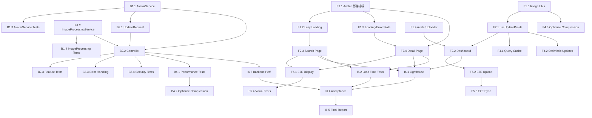

# Avatar 功能驗證與優化 - 開發任務拆解

**專案**: Avatar 完整驗證與優化
**日期**: 2026-01-21
**狀態**: Ready for Development
**預計時程**: 7 個工作天

---

## 📊 任務總覽

**總任務數**: 45 個原子任務
- Backend: 22 個任務
- Frontend: 18 個任務
- 整合測試: 5 個任務

**可並行任務**: 35 個任務 (78%)
**依賴任務**: 10 個任務 (22%)

---

## 🎯 Phase 1: 基礎服務層實作（Backend + Frontend 並行）

**時程**: Day 1-2
**目標**: 建立核心服務和組件基礎

### Backend Tasks (可並行)

#### B1.1 建立 AvatarService
- **檔案**: `my_profile_laravel/app/Services/AvatarService.php`
- **優先級**: 🔴 Critical
- **時間**: 4 小時
- **依賴**: 無
- **內容**:
  ```php
  - validateDataUrlFormat(string $dataUrl): bool
  - validateMimeType(string $mime): bool
  - validateFileSize(int $size): bool
  - validateImageContent(string $base64): bool
  - processAvatar(string $dataUrl): array
  ```
- **驗收**:
  - [ ] 所有驗證方法實作完成
  - [ ] 支援 5 種驗證規則 (VR-001 to VR-005)
  - [ ] 拋出清晰的異常訊息
  - [ ] 返回處理後的資料 (data, mime, size)

#### B1.2 建立 ImageProcessingService
- **檔案**: `my_profile_laravel/app/Services/ImageProcessingService.php`
- **優先級**: 🔴 Critical
- **時間**: 4 小時
- **依賴**: 無
- **內容**:
  ```php
  - compressImage(string $base64, string $mime): string
  - resizeImage($gdImage, int $maxWidth, int $maxHeight): resource
  - encodeImage($gdImage, string $mime, int $quality): string
  ```
- **驗收**:
  - [ ] 支援 JPEG, PNG, WebP, GIF 格式
  - [ ] 壓縮到 400x400 (保持寬高比)
  - [ ] JPEG 80% 品質, PNG level 8
  - [ ] 保留透明背景 (PNG/GIF)

#### B1.3 單元測試 - AvatarService
- **檔案**: `my_profile_laravel/tests/Unit/Services/AvatarServiceTest.php`
- **優先級**: 🟡 High
- **時間**: 3 小時
- **依賴**: B1.1 完成
- **測試案例**:
  - [ ] test_validateDataUrlFormat_validFormat_returnsTrue()
  - [ ] test_validateDataUrlFormat_invalidFormat_returnsFalse()
  - [ ] test_validateMimeType_validMime_returnsTrue()
  - [ ] test_validateMimeType_svg_returnsFalse()
  - [ ] test_validateFileSize_withinLimit_returnsTrue()
  - [ ] test_validateFileSize_exceedsLimit_returnsFalse()
  - [ ] test_validateImageContent_validImage_returnsTrue()
  - [ ] test_validateImageContent_corruptedImage_returnsFalse()
  - [ ] test_processAvatar_validInput_returnsProcessedData()
- **驗收**:
  - [ ] 測試覆蓋率 >= 90%
  - [ ] 所有邊界情況測試通過

#### B1.4 單元測試 - ImageProcessingService
- **檔案**: `my_profile_laravel/tests/Unit/Services/ImageProcessingServiceTest.php`
- **優先級**: 🟡 High
- **時間**: 3 小時
- **依賴**: B1.2 完成
- **測試案例**:
  - [ ] test_compressImage_largeImage_compressesSuccessfully()
  - [ ] test_compressImage_smallImage_remainsUnchanged()
  - [ ] test_resizeImage_landscapeImage_maintainsAspectRatio()
  - [ ] test_resizeImage_portraitImage_maintainsAspectRatio()
  - [ ] test_resizeImage_squareImage_resizesCorrectly()
  - [ ] test_encodeImage_jpeg_returnsBase64()
  - [ ] test_encodeImage_png_preservesTransparency()
- **驗收**:
  - [ ] 測試覆蓋率 >= 90%
  - [ ] 效能測試通過 (< 200ms)

### Frontend Tasks (可並行)

#### F1.1 優化 Avatar 組件 - 基礎結構
- **檔案**: `frontend/components/ui/avatar.tsx`
- **優先級**: 🔴 Critical
- **時間**: 3 小時
- **依賴**: 無
- **新增 Props**:
  ```typescript
  interface AvatarProps {
    src?: string | null;
    size?: 'xs' | 'sm' | 'md' | 'lg' | 'xl' | '2xl';
    fallback?: string;
    lazy?: boolean;              // 新增
    priority?: boolean;          // 新增
    onLoad?: () => void;         // 新增
    onError?: () => void;        // 新增
    status?: 'online' | 'offline' | 'away' | 'busy';
  }
  ```
- **驗收**:
  - [ ] 新增 Props 定義完成
  - [ ] 向後兼容現有使用
  - [ ] TypeScript 無錯誤

#### F1.2 實作 Lazy Loading (Intersection Observer)
- **檔案**: `frontend/components/ui/avatar.tsx`
- **優先級**: 🔴 Critical
- **時間**: 2 小時
- **依賴**: F1.1 完成
- **實作內容**:
  ```typescript
  - 使用 useEffect + IntersectionObserver
  - lazy=true 時延遲載入圖片
  - isInView state 追蹤可見性
  - 進入視口後才設置 img.src
  ```
- **驗收**:
  - [ ] lazy=true 時圖片不立即載入
  - [ ] 進入視口後才載入
  - [ ] 多個 Avatar 正確運作
  - [ ] 離開視口後不重複載入

#### F1.3 實作 Loading 和 Error State
- **檔案**: `frontend/components/ui/avatar.tsx`
- **優先級**: 🟡 High
- **時間**: 2 小時
- **依賴**: F1.1 完成
- **實作內容**:
  ```typescript
  - imageLoaded state 追蹤載入狀態
  - imageError state 追蹤錯誤
  - onLoad 回調觸發
  - onError 回調觸發
  - 淡入動畫 (opacity transition)
  - 錯誤時自動顯示 Fallback
  ```
- **驗收**:
  - [ ] 載入中顯示 Skeleton
  - [ ] 載入完成淡入顯示
  - [ ] 錯誤時顯示 Fallback
  - [ ] onLoad/onError 回調正確觸發

#### F1.4 建立 AvatarUploader 組件
- **檔案**: `frontend/components/ui/avatar-uploader.tsx` (新增)
- **優先級**: 🔴 Critical
- **時間**: 4 小時
- **依賴**: 無
- **組件結構**:
  ```typescript
  interface AvatarUploaderProps {
    currentAvatar?: string | null;
    onUploadComplete?: (base64: string) => void;
    onUploadError?: (error: Error) => void;
    maxSizeMB?: number;
    showComparison?: boolean;
    showFileInfo?: boolean;
  }
  ```
- **功能**:
  - 檔案選擇 (input type="file")
  - 即時預覽
  - 壓縮提示 (節省 XX%)
  - 對比顯示 (當前 vs 新)
  - 錯誤處理與顯示
- **驗收**:
  - [ ] 檔案選擇正常
  - [ ] 即時預覽顯示
  - [ ] 壓縮提示正確
  - [ ] 對比顯示正常
  - [ ] 錯誤友善提示

#### F1.5 實作圖片處理工具函數
- **檔案**: `frontend/lib/utils/image.ts`
- **優先級**: 🔴 Critical
- **時間**: 3 小時
- **依賴**: 無
- **函數**:
  ```typescript
  - processImageUpload(file: File): Promise<ProcessedImage>
  - compressImage(file: File, maxSizeMB: number): Promise<File>
  - fileToBase64(file: File): Promise<string>
  - validateImageFile(file: File): ValidationResult
  ```
- **驗收**:
  - [ ] 完整上傳流程實作
  - [ ] Canvas 壓縮正常
  - [ ] Base64 轉換正確
  - [ ] 檔案驗證完整

---

## 🔧 Phase 2: Controller 與 API 整合（Backend + Frontend 並行）

**時程**: Day 3
**目標**: 整合服務層到 API 端點，前端整合 API

### Backend Tasks

#### B2.1 修改 UpdateSalespersonProfileRequest
- **檔案**: `my_profile_laravel/app/Http/Requests/UpdateSalespersonProfileRequest.php`
- **優先級**: 🔴 Critical
- **時間**: 1 小時
- **依賴**: B1.1 完成
- **修改內容**:
  ```php
  public function rules(): array
  {
      return [
          'full_name' => ['nullable', 'string', 'max:100'],
          'phone' => ['nullable', 'string', 'regex:/^09\d{8}$/'],
          'avatar' => [
              'nullable',
              'string',
              'regex:/^data:image\/(jpeg|png|webp|gif);base64,[A-Za-z0-9+\/]+=*$/',
              new MaxBase64Size(2 * 1024 * 1024), // 2MB
          ],
      ];
  }
  ```
- **驗收**:
  - [ ] Avatar 驗證規則完整
  - [ ] 錯誤訊息清晰
  - [ ] 支援 nullable (可選上傳)

#### B2.2 修改 SalespersonController::updateProfile
- **檔案**: `my_profile_laravel/app/Http/Controllers/Api/SalespersonController.php`
- **優先級**: 🔴 Critical
- **時間**: 2 小時
- **依賴**: B1.1, B1.2, B2.1 完成
- **修改內容**:
  ```php
  public function updateProfile(UpdateSalespersonProfileRequest $request): JsonResponse
  {
      // 1. 權限檢查
      // 2. 處理 avatar (使用 AvatarService)
      // 3. 更新 profile
      // 4. 返回 response with avatar data URL
  }
  ```
- **驗收**:
  - [ ] Avatar 處理正常
  - [ ] 返回 data URL
  - [ ] 錯誤處理完善
  - [ ] 日誌記錄清晰

#### B2.3 Feature 測試 - 上傳 Avatar
- **檔案**: `my_profile_laravel/tests/Feature/Api/Salesperson/UpdateProfileTest.php`
- **優先級**: 🟡 High
- **時間**: 3 小時
- **依賴**: B2.2 完成
- **測試案例**:
  - [ ] test_updateProfile_withValidJpeg_updatesSuccessfully()
  - [ ] test_updateProfile_withValidPng_updatesSuccessfully()
  - [ ] test_updateProfile_withValidWebp_updatesSuccessfully()
  - [ ] test_updateProfile_withValidGif_updatesSuccessfully()
  - [ ] test_updateProfile_withSvg_returnsValidationError()
  - [ ] test_updateProfile_withOversizedImage_returnsValidationError()
  - [ ] test_updateProfile_withInvalidBase64_returnsValidationError()
  - [ ] test_updateProfile_withCorruptedImage_returnsValidationError()
  - [ ] test_updateProfile_withLargeImage_compressesAutomatically()
  - [ ] test_updateProfile_asNonSalesperson_returnsForbidden()
  - [ ] test_updateProfile_unauthenticated_returnsUnauthorized()
- **驗收**:
  - [ ] 所有 Happy Path 測試通過
  - [ ] 所有 Validation 測試通過
  - [ ] 錯誤處理測試通過

### Frontend Tasks (可並行)

#### F2.1 更新 useUpdateProfile Hook
- **檔案**: `frontend/hooks/useSalesperson.ts`
- **優先級**: 🔴 Critical
- **時間**: 1 小時
- **依賴**: F1.5 完成
- **修改內容**:
  ```typescript
  export const useUpdateProfile = () => {
    return useMutation({
      mutationFn: async (data: UpdateProfileData) => {
        // 處理 avatar 檔案 (如果有)
        if (data.avatarFile) {
          const processed = await processImageUpload(data.avatarFile);
          data.avatar = processed.base64;
        }
        return await api.updateProfile(data);
      },
      onSuccess: () => {
        // Cache invalidation
        queryClient.invalidateQueries(['salesperson', 'profile']);
        queryClient.invalidateQueries(['salespeople']);
        queryClient.invalidateQueries(['salesperson']);
      },
    });
  };
  ```
- **驗收**:
  - [ ] 檔案處理正常
  - [ ] Cache invalidation 正確
  - [ ] 樂觀更新實作

#### F2.2 更新 Dashboard 頁面 - Avatar 上傳
- **檔案**: `frontend/app/(dashboard)/dashboard/page.tsx`
- **優先級**: 🔴 Critical
- **時間**: 3 小時
- **依賴**: F1.4, F2.1 完成
- **修改內容**:
  - 整合 AvatarUploader 組件
  - 相機按鈕互動
  - 即時預覽
  - 儲存功能
  - Toast 通知
- **驗收**:
  - [ ] Avatar 上傳正常
  - [ ] 即時預覽顯示
  - [ ] 儲存後更新 UI
  - [ ] 錯誤友善提示

#### F2.3 更新 Search 頁面 - Lazy Loading
- **檔案**: `frontend/app/search/page.tsx`
- **優先級**: 🟡 High
- **時間**: 1 小時
- **依賴**: F1.2 完成
- **修改內容**:
  ```tsx
  <Avatar
    src={salesperson.avatar}
    fallback={salesperson.full_name}
    size="md"
    lazy={true}  // 啟用 Lazy Loading
  />
  ```
- **驗收**:
  - [ ] Lazy Loading 正常運作
  - [ ] Skeleton Loading 顯示
  - [ ] 效能改善明顯

#### F2.4 更新 Salesperson Detail 頁面
- **檔案**: `frontend/app/salesperson/[id]/page.tsx`
- **優先級**: 🟡 High
- **時間**: 1 小時
- **依賴**: F1.1, F1.3 完成
- **修改內容**:
  ```tsx
  <Avatar
    src={salesperson.avatar}
    fallback={salesperson.full_name}
    size="2xl"
    priority={true}  // 高優先級載入
    onLoad={() => console.log('Avatar loaded')}
  />
  ```
- **驗收**:
  - [ ] 高優先級載入
  - [ ] 淡入動畫顯示
  - [ ] Loading state 正常

---

## 🔐 Phase 3: 安全性與錯誤處理強化（Backend）

**時程**: Day 4
**目標**: 完善安全驗證和錯誤處理

### Backend Tasks

#### B3.1 實作自定義驗證規則 - MaxBase64Size
- **檔案**: `my_profile_laravel/app/Rules/MaxBase64Size.php` (新增)
- **優先級**: 🟡 High
- **時間**: 1 小時
- **依賴**: 無
- **內容**:
  ```php
  class MaxBase64Size implements ValidationRule
  {
      public function validate(string $attribute, mixed $value, Closure $fail): void
      {
          // 解碼 Base64 並檢查大小
      }
  }
  ```
- **驗收**:
  - [ ] 正確解碼 Base64
  - [ ] 檢查大小限制
  - [ ] 友善錯誤訊息

#### B3.2 實作 Rate Limiting
- **檔案**: `my_profile_laravel/app/Http/Kernel.php`
- **優先級**: 🟡 High
- **時間**: 1 小時
- **依賴**: 無
- **內容**:
  ```php
  'throttle:10,1' // 10 次/分鐘
  ```
- **驗收**:
  - [ ] Rate Limiting 正常運作
  - [ ] 超過限制返回 429
  - [ ] 錯誤訊息清晰

#### B3.3 完善錯誤處理與日誌
- **檔案**: `my_profile_laravel/app/Http/Controllers/Api/SalespersonController.php`
- **優先級**: 🟡 High
- **時間**: 2 小時
- **依賴**: B2.2 完成
- **內容**:
  - try-catch 包裹處理邏輯
  - 記錄錯誤日誌
  - 返回標準化錯誤格式
  - 不洩漏敏感資訊
- **驗收**:
  - [ ] 所有異常被捕獲
  - [ ] 日誌記錄清晰
  - [ ] 錯誤格式標準化

#### B3.4 安全測試 - XSS 與檔案偽造
- **檔案**: `my_profile_laravel/tests/Feature/Security/AvatarSecurityTest.php` (新增)
- **優先級**: 🔴 Critical
- **時間**: 2 小時
- **依賴**: B2.2 完成
- **測試案例**:
  - [ ] test_uploadAvatar_withSvgContainingScript_isRejected()
  - [ ] test_uploadAvatar_withJpegDisguisedAsPng_isRejected()
  - [ ] test_uploadAvatar_withMalformedImage_isRejected()
  - [ ] test_uploadAvatar_withExecutableDisguisedAsImage_isRejected()
- **驗收**:
  - [ ] 所有安全測試通過
  - [ ] 無 XSS 漏洞
  - [ ] 檔案偽造被阻擋

---

## ✨ Phase 4: 效能優化與快取（Backend + Frontend 並行）

**時程**: Day 5
**目標**: 優化效能，達到量化指標

### Backend Tasks

#### B4.1 效能測試 - 基準測試
- **檔案**: `my_profile_laravel/tests/Performance/AvatarPerformanceTest.php` (新增)
- **優先級**: 🟡 High
- **時間**: 2 小時
- **依賴**: B2.2 完成
- **測試案例**:
  - [ ] test_uploadAvatar_processingTime_isWithinLimit()
  - [ ] test_uploadAvatar_concurrentRequests_handlesCorrectly()
  - [ ] test_compressImage_processingTime_isWithinLimit()
- **目標**:
  - P95 < 500ms (含 Avatar 處理)
  - 支援 >= 20 req/s 並發
- **驗收**:
  - [ ] 所有效能測試通過
  - [ ] 達到量化指標

#### B4.2 優化壓縮效能
- **檔案**: `my_profile_laravel/app/Services/ImageProcessingService.php`
- **優先級**: 🟡 High
- **時間**: 2 小時
- **依賴**: B4.1 完成
- **優化項目**:
  - 只在必要時壓縮 (> 400x400 or > 500KB)
  - 使用最佳 GD 設定
  - 避免重複解碼
- **驗收**:
  - [ ] 壓縮時間 < 200ms
  - [ ] 小圖不壓縮
  - [ ] 記憶體使用優化

### Frontend Tasks (可並行)

#### F4.1 React Query 快取優化
- **檔案**: `frontend/lib/query/queryClient.ts`
- **優先級**: 🟡 High
- **時間**: 1 小時
- **依賴**: F2.1 完成
- **修改內容**:
  ```typescript
  export const queryClient = new QueryClient({
    defaultOptions: {
      queries: {
        staleTime: 5 * 60 * 1000,      // 5 分鐘
        cacheTime: 10 * 60 * 1000,     // 10 分鐘
        retry: 1,
        refetchOnWindowFocus: false,
      }
    }
  });
  ```
- **驗收**:
  - [ ] 快取配置正確
  - [ ] API 請求減少
  - [ ] UX 無影響

#### F4.2 實作樂觀更新
- **檔案**: `frontend/hooks/useSalesperson.ts`
- **優先級**: 🟢 Medium
- **時間**: 2 小時
- **依賴**: F2.1 完成
- **實作內容**:
  ```typescript
  onMutate: async (newData) => {
    // Cancel outgoing queries
    await queryClient.cancelQueries(['salesperson', 'profile']);

    // Snapshot previous value
    const previous = queryClient.getQueryData(['salesperson', 'profile']);

    // Optimistically update
    queryClient.setQueryData(['salesperson', 'profile'], newData);

    return { previous };
  },
  onError: (err, newData, context) => {
    // Rollback on error
    queryClient.setQueryData(['salesperson', 'profile'], context.previous);
  },
  ```
- **驗收**:
  - [ ] 立即更新 UI
  - [ ] 錯誤時回滾
  - [ ] UX 流暢

#### F4.3 圖片壓縮效能優化
- **檔案**: `frontend/lib/utils/image.ts`
- **優先級**: 🟡 High
- **時間**: 2 小時
- **依賴**: F1.5 完成
- **優化項目**:
  - 使用 Web Worker (如果可行)
  - 壓縮品質階梯式降低 (0.8 → 0.6 → 0.5)
  - 顯示壓縮進度
- **驗收**:
  - [ ] 壓縮時間 < 2s (2MB 檔案)
  - [ ] 不阻塞 UI
  - [ ] 壓縮提示清晰

---

## 🧪 Phase 5: E2E 測試與跨頁面驗證（Frontend）

**時程**: Day 6
**目標**: 完整測試使用者流程

### Frontend Tasks

#### F5.1 E2E 測試 - Avatar 顯示
- **檔案**: `frontend/tests/e2e/avatar-display.spec.ts` (新增)
- **優先級**: 🔴 Critical
- **時間**: 2 小時
- **依賴**: F2.3, F2.4 完成
- **測試案例**:
  ```typescript
  test('search page displays avatars with lazy loading', async ({ page }) => {
    // 1. Navigate to search
    // 2. Wait for list load
    // 3. Verify avatar count = 20
    // 4. Verify lazy loading works
  });

  test('detail page displays avatar with priority', async ({ page }) => {
    // 1. Navigate to detail
    // 2. Verify avatar loads immediately
    // 3. Verify fade-in animation
  });
  ```
- **驗收**:
  - [ ] Search 頁面測試通過
  - [ ] Detail 頁面測試通過
  - [ ] Lazy Loading 驗證成功

#### F5.2 E2E 測試 - Avatar 上傳
- **檔案**: `frontend/tests/e2e/avatar-upload.spec.ts` (新增)
- **優先級**: 🔴 Critical
- **時間**: 3 小時
- **依賴**: F2.2 完成
- **測試案例**:
  ```typescript
  test('dashboard avatar upload flow', async ({ page }) => {
    // 1. Login as salesperson
    // 2. Navigate to dashboard
    // 3. Click camera button
    // 4. Upload image
    // 5. Verify preview
    // 6. Save
    // 7. Verify success toast
    // 8. Verify avatar updated
  });

  test('avatar upload validation errors', async ({ page }) => {
    // 1. Try upload oversized file
    // 2. Verify error message
    // 3. Try upload invalid format
    // 4. Verify error message
  });
  ```
- **驗收**:
  - [ ] 完整上傳流程測試通過
  - [ ] 驗證錯誤測試通過
  - [ ] Toast 通知顯示正常

#### F5.3 E2E 測試 - 跨頁面同步
- **檔案**: `frontend/tests/e2e/avatar-sync.spec.ts` (新增)
- **優先級**: 🔴 Critical
- **時間**: 2 小時
- **依賴**: F5.2 完成
- **測試案例**:
  ```typescript
  test('avatar syncs across all pages', async ({ page, context }) => {
    // 1. Login as salesperson
    // 2. Open dashboard in tab 1
    // 3. Open search in tab 2
    // 4. Upload avatar in tab 1
    // 5. Verify tab 2 updates automatically
    // 6. Navigate to detail in tab 2
    // 7. Verify avatar matches
  });
  ```
- **驗收**:
  - [ ] Dashboard → Search 同步正常
  - [ ] Dashboard → Detail 同步正常
  - [ ] 無需手動刷新

#### F5.4 Visual Regression 測試
- **檔案**: `frontend/tests/visual/avatar.spec.ts` (新增)
- **優先級**: 🟢 Medium
- **時間**: 2 小時
- **依賴**: F5.1 完成
- **測試案例**:
  - [ ] Avatar 各尺寸快照 (xs, sm, md, lg, xl, 2xl)
  - [ ] Fallback 顯示快照
  - [ ] Loading 狀態快照
  - [ ] Error 狀態快照
- **驗收**:
  - [ ] 所有快照正常
  - [ ] 無視覺回歸

---

## 📊 Phase 6: 效能測試與報告（整合測試）

**時程**: Day 7
**目標**: 驗證效能指標，產生報告

### 整合測試 Tasks

#### I6.1 Lighthouse 效能測試
- **工具**: Lighthouse CI
- **優先級**: 🟡 High
- **時間**: 1 小時
- **依賴**: 所有前端實作完成
- **測試頁面**:
  - Search page (http://localhost:3001/search)
  - Detail page (http://localhost:3001/salesperson/1)
  - Dashboard (http://localhost:3001/dashboard)
- **目標指標**:
  - LCP < 2.5s
  - FCP < 1.8s
  - FID < 100ms
  - CLS < 0.1
- **驗收**:
  - [ ] 所有頁面達到目標
  - [ ] 效能報告產出

#### I6.2 Avatar 載入時間測試
- **工具**: Chrome DevTools Performance
- **優先級**: 🟡 High
- **時間**: 1 小時
- **依賴**: F2.3, F2.4 完成
- **測試案例**:
  - 單張 Avatar 載入時間 (Detail page)
  - 20 個 Avatar 載入時間 (Search page)
  - 壓縮處理時間 (Dashboard)
- **目標指標**:
  - 單張 < 500ms
  - 列表 < 2s
  - 壓縮 < 2s (2MB 檔案)
- **驗收**:
  - [ ] 所有測試達到目標
  - [ ] 測試報告產出

#### I6.3 後端 API 效能測試
- **工具**: Apache Bench / Artillery
- **優先級**: 🟡 High
- **時間**: 2 小時
- **依賴**: B2.2 完成
- **測試案例**:
  - PUT /api/salesperson/profile (含 Avatar)
  - 並發 20 req/s
  - 持續 1 分鐘
- **目標指標**:
  - P50 < 300ms
  - P95 < 500ms
  - P99 < 1000ms
  - 錯誤率 < 0.5%
- **驗收**:
  - [ ] 所有指標達標
  - [ ] 效能報告產出

#### I6.4 完整功能驗收測試
- **優先級**: 🔴 Critical
- **時間**: 2 小時
- **依賴**: 所有實作完成
- **驗收清單**:
  - [ ] 所有頁面 Avatar 正確顯示
  - [ ] Fallback 機制正常運作
  - [ ] 上傳流程完整
  - [ ] 檔案驗證完整
  - [ ] 跨頁面同步更新
  - [ ] 錯誤處理完善
  - [ ] 安全防護有效
  - [ ] 效能達到目標
  - [ ] 測試覆蓋率達標
- **產出**: 驗收報告

#### I6.5 產生最終報告
- **檔案**: `openspec/changes/20260121-verify-optimize-avatar/final-report.md`
- **優先級**: 🟡 High
- **時間**: 1 小時
- **依賴**: 所有測試完成
- **內容**:
  - 功能完成度
  - 測試覆蓋率
  - 效能測試結果
  - 安全測試結果
  - 已知問題
  - 後續建議
- **驗收**:
  - [ ] 報告完整
  - [ ] 量化指標清晰
  - [ ] 截圖和數據齊全

---

## 📋 任務依賴關係圖



---

## 🚀 執行策略

### 並行開發

**Day 1-2**: Phase 1
- Backend Team: B1.1, B1.2, B1.3, B1.4 (並行)
- Frontend Team: F1.1, F1.2, F1.3, F1.4, F1.5 (並行)

**Day 3**: Phase 2
- Backend Team: B2.1 → B2.2 → B2.3 (順序)
- Frontend Team: F2.1 → F2.2, F2.3, F2.4 (F2.1 完成後並行)

**Day 4**: Phase 3
- Backend Team: B3.1, B3.2 (並行) → B3.3, B3.4

**Day 5**: Phase 4
- Backend Team: B4.1 → B4.2
- Frontend Team: F4.1, F4.2, F4.3 (並行)

**Day 6**: Phase 5
- Frontend Team: F5.1, F5.2 (並行) → F5.3 → F5.4

**Day 7**: Phase 6
- QA Team: I6.1, I6.2, I6.3 (並行) → I6.4 → I6.5

### 關鍵路徑 (Critical Path)

```
B1.1 → B2.1 → B2.2 → B2.3 → B3.3 → B4.1 → B4.2 → I6.3 → I6.4 → I6.5
```

**關鍵路徑時長**: 21 小時 (約 3 個工作天)
**實際時程**: 7 個工作天 (因為並行和測試)

---

## ✅ 驗收標準總覽

### 功能驗收
- [ ] 所有 Backend 驗證規則實作並測試通過
- [ ] 所有 Frontend 組件實作並測試通過
- [ ] 圖片壓縮功能正常
- [ ] 跨頁面同步更新正常
- [ ] 錯誤處理完善

### 安全驗收
- [ ] 拒絕 SVG 上傳
- [ ] 防止檔案偽造
- [ ] Rate Limiting 正常運作
- [ ] 無 XSS 漏洞

### 效能驗收
- [ ] Backend P95 < 500ms
- [ ] Frontend LCP < 2.5s, FCP < 1.8s
- [ ] Avatar 載入 < 500ms (單張)
- [ ] 列表載入 < 2s (20 個)
- [ ] 並發處理 >= 20 req/s

### 測試驗收
- [ ] Backend Feature Tests 覆蓋率 >= 95%
- [ ] Backend Unit Tests 覆蓋率 >= 90%
- [ ] Frontend E2E Tests 覆蓋率 >= 80%
- [ ] PHPStan Level 9 通過
- [ ] TypeScript strict mode 無錯誤

---

**建立日期**: 2026-01-21
**維護者**: Development Team
**狀態**: Ready for Implementation
