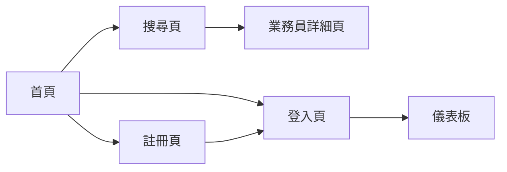
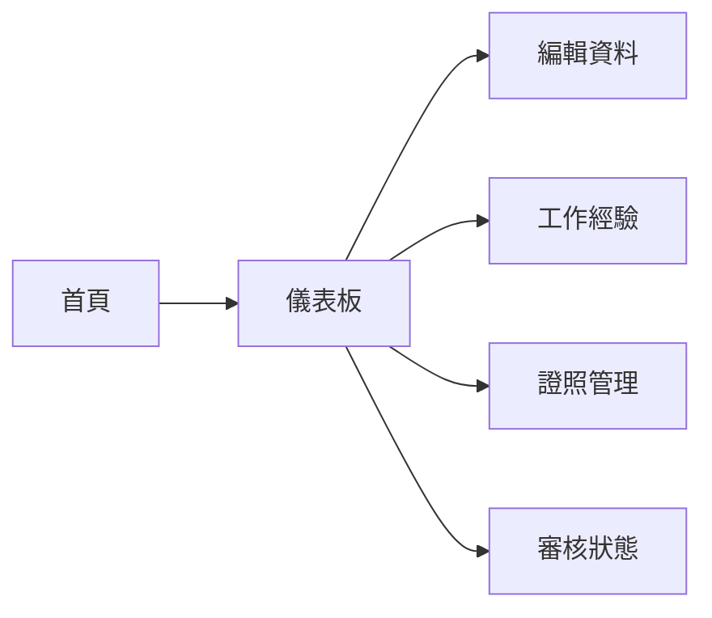
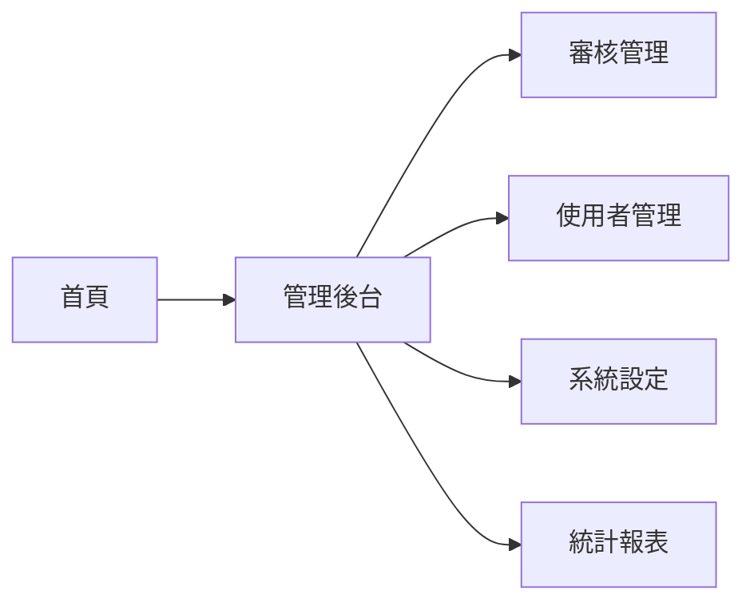

# State Management & Routing Specification

**Project**: YAMU Frontend SPA
**Version**: 1.0.0
**Last Updated**: 2026-01-08

---

## Overview

本規格定義：
1. **狀態管理架構** - Zustand + React Query 雙層架構
2. **路由結構** - Next.js App Router 設計
3. **權限控制** - Route Guards 與權限檢查
4. **導航流程** - 用戶旅程與頁面跳轉邏輯

---

## State Management Architecture

### Two-Layer Architecture

```
┌─────────────────────────────────────┐
│  Server State (React Query)         │
│  - API 資料快取                      │
│  - 自動重新驗證                      │
│  - Loading/Error 狀態                │
└─────────────────────────────────────┘
            ↓ ↑
┌─────────────────────────────────────┐
│  Client State (Zustand)              │
│  - UI 狀態 (側邊欄開關、Modal 等)    │
│  - 表單暫存資料                      │
│  - 主題設定                          │
└─────────────────────────────────────┘
```

**原則**:
- Server State (API 資料) → React Query
- Client State (UI 狀態) → Zustand
- 避免在 Zustand 儲存 API 資料（會導致資料不同步）

---

## React Query Setup

### Query Client Configuration

```typescript
// lib/query/client.ts
import { QueryClient } from '@tanstack/react-query';

export const queryClient = new QueryClient({
  defaultOptions: {
    queries: {
      staleTime: 60 * 1000, // 1 分鐘後視為 stale
      cacheTime: 5 * 60 * 1000, // 5 分鐘後清除快取
      retry: 1, // 失敗後重試 1 次
      refetchOnWindowFocus: false, // 視窗聚焦時不重新載入
      refetchOnReconnect: true, // 網路重新連線時重新載入
    },
    mutations: {
      retry: false, // Mutation 不重試
    },
  },
});
```

### Provider Setup

```typescript
// app/providers.tsx
'use client';

import { QueryClientProvider } from '@tanstack/react-query';
import { ReactQueryDevtools } from '@tanstack/react-query-devtools';
import { queryClient } from '@/lib/query/client';
import { Toaster } from 'sonner';

export function Providers({ children }: { children: React.ReactNode }) {
  return (
    <QueryClientProvider client={queryClient}>
      {children}
      <Toaster position="top-right" richColors />
      {process.env.NODE_ENV === 'development' && (
        <ReactQueryDevtools initialIsOpen={false} />
      )}
    </QueryClientProvider>
  );
}

// app/layout.tsx
export default function RootLayout({ children }: { children: React.ReactNode }) {
  return (
    <html lang="zh-TW">
      <body>
        <Providers>{children}</Providers>
      </body>
    </html>
  );
}
```

---

## Server State (React Query)

### Query Keys Convention

```typescript
// lib/query/keys.ts
export const queryKeys = {
  // 認證相關
  auth: {
    me: ['auth', 'me'] as const,
  },

  // 搜尋相關
  search: {
    salespersons: (params: SearchParams) => ['search', 'salespersons', params] as const,
    detail: (id: number) => ['search', 'salespersons', id] as const,
  },

  // 業務員相關
  salesperson: {
    profile: ['salesperson', 'profile'] as const,
    experiences: ['salesperson', 'experiences'] as const,
    certifications: ['salesperson', 'certifications'] as const,
    approvalStatus: ['salesperson', 'approval-status'] as const,
  },

  // 管理員相關
  admin: {
    pendingApprovals: ['admin', 'pending-approvals'] as const,
    users: (params?: UsersParams) => ['admin', 'users', params] as const,
    statistics: ['admin', 'statistics'] as const,
    industries: ['admin', 'industries'] as const,
    regions: ['admin', 'regions'] as const,
  },
} as const;
```

### Custom Hooks

#### Authentication Hooks

```typescript
// hooks/useAuth.ts
import { useQuery, useMutation, useQueryClient } from '@tanstack/react-query';
import { getCurrentUser, login, logout, register } from '@/lib/api/auth';
import { queryKeys } from '@/lib/query/keys';

/**
 * 取得當前登入使用者
 */
export function useAuth() {
  return useQuery({
    queryKey: queryKeys.auth.me,
    queryFn: getCurrentUser,
    retry: false,
    staleTime: 5 * 60 * 1000, // 5 分鐘
  });
}

/**
 * 登入 Mutation
 */
export function useLogin() {
  const queryClient = useQueryClient();

  return useMutation({
    mutationFn: login,
    onSuccess: (data) => {
      // 設定使用者快取
      queryClient.setQueryData(queryKeys.auth.me, {
        status: 'success',
        data: data.data.user,
      });
      toast.success('登入成功！');
    },
    onError: handleApiError,
  });
}

/**
 * 登出 Mutation
 */
export function useLogout() {
  const queryClient = useQueryClient();
  const router = useRouter();

  return useMutation({
    mutationFn: logout,
    onSuccess: () => {
      // 清除所有快取
      queryClient.clear();
      toast.success('已登出');
      router.push('/login');
    },
  });
}

/**
 * 註冊 Mutation
 */
export function useRegister() {
  const router = useRouter();

  return useMutation({
    mutationFn: register,
    onSuccess: () => {
      toast.success('註冊成功！請登入');
      router.push('/login');
    },
    onError: handleApiError,
  });
}
```

#### Search Hooks

```typescript
// hooks/useSearch.ts
import { useQuery } from '@tanstack/react-query';
import { searchSalespersons, getSalespersonDetail } from '@/lib/api/search';
import { queryKeys } from '@/lib/query/keys';

/**
 * 搜尋業務員
 */
export function useSearchSalespersons(params: SearchParams) {
  return useQuery({
    queryKey: queryKeys.search.salespersons(params),
    queryFn: () => searchSalespersons(params),
    enabled: !!params, // 有參數才執行
    keepPreviousData: true, // 換頁時保留舊資料
  });
}

/**
 * 取得業務員詳細資料
 */
export function useSalespersonDetail(id: number) {
  return useQuery({
    queryKey: queryKeys.search.detail(id),
    queryFn: () => getSalespersonDetail(id),
    enabled: !!id,
    staleTime: 10 * 60 * 1000, // 10 分鐘
  });
}
```

#### Salesperson Hooks

```typescript
// hooks/useSalesperson.ts
import { useQuery, useMutation, useQueryClient } from '@tantml:react-query';
import {
  getProfile,
  updateProfile,
  getExperiences,
  createExperience,
  deleteExperience,
} from '@/lib/api/salesperson';
import { queryKeys } from '@/lib/query/keys';

/**
 * 取得個人檔案
 */
export function useProfile() {
  return useQuery({
    queryKey: queryKeys.salesperson.profile,
    queryFn: getProfile,
  });
}

/**
 * 更新個人檔案
 */
export function useUpdateProfile() {
  const queryClient = useQueryClient();

  return useMutation({
    mutationFn: updateProfile,
    onSuccess: () => {
      // 刷新個人檔案
      queryClient.invalidateQueries({ queryKey: queryKeys.salesperson.profile });
      toast.success('個人資料已更新');
    },
    onError: handleApiError,
  });
}

/**
 * 取得工作經驗列表
 */
export function useExperiences() {
  return useQuery({
    queryKey: queryKeys.salesperson.experiences,
    queryFn: getExperiences,
  });
}

/**
 * 新增工作經驗
 */
export function useCreateExperience() {
  const queryClient = useQueryClient();

  return useMutation({
    mutationFn: createExperience,
    onSuccess: () => {
      queryClient.invalidateQueries({ queryKey: queryKeys.salesperson.experiences });
      toast.success('工作經驗已新增');
    },
    onError: handleApiError,
  });
}

/**
 * 刪除工作經驗
 */
export function useDeleteExperience() {
  const queryClient = useQueryClient();

  return useMutation({
    mutationFn: deleteExperience,
    onSuccess: () => {
      queryClient.invalidateQueries({ queryKey: queryKeys.salesperson.experiences });
      toast.success('工作經驗已刪除');
    },
    onError: handleApiError,
  });
}
```

#### Admin Hooks

```typescript
// hooks/useAdmin.ts
import { useQuery, useMutation, useQueryClient } from '@tanstack/react-query';
import {
  getPendingApprovals,
  approveUser,
  rejectUser,
  getStatistics,
} from '@/lib/api/admin';
import { queryKeys } from '@/lib/query/keys';

/**
 * 取得待審核項目
 */
export function usePendingApprovals() {
  return useQuery({
    queryKey: queryKeys.admin.pendingApprovals,
    queryFn: getPendingApprovals,
    refetchInterval: 30 * 1000, // 每 30 秒自動刷新
  });
}

/**
 * 審核通過使用者
 */
export function useApproveUser() {
  const queryClient = useQueryClient();

  return useMutation({
    mutationFn: approveUser,
    onSuccess: () => {
      // 刷新待審核列表
      queryClient.invalidateQueries({ queryKey: queryKeys.admin.pendingApprovals });
      queryClient.invalidateQueries({ queryKey: queryKeys.admin.statistics });
      toast.success('審核已通過');
    },
    onError: handleApiError,
  });
}

/**
 * 取得統計資料
 */
export function useStatistics() {
  return useQuery({
    queryKey: queryKeys.admin.statistics,
    queryFn: getStatistics,
    staleTime: 2 * 60 * 1000, // 2 分鐘
  });
}
```

---

## Client State (Zustand)

### Store Structure

```typescript
// store/use-ui-store.ts
import { create } from 'zustand';
import { persist } from 'zustand/middleware';

interface UIState {
  // Sidebar State
  isSidebarOpen: boolean;
  toggleSidebar: () => void;

  // Theme
  theme: 'light' | 'dark';
  setTheme: (theme: 'light' | 'dark') => void;

  // Search Filters (暫存)
  searchFilters: SearchParams;
  setSearchFilters: (filters: SearchParams) => void;
  resetSearchFilters: () => void;
}

export const useUIStore = create<UIState>()(
  persist(
    (set) => ({
      // Sidebar
      isSidebarOpen: true,
      toggleSidebar: () => set((state) => ({ isSidebarOpen: !state.isSidebarOpen })),

      // Theme
      theme: 'light',
      setTheme: (theme) => set({ theme }),

      // Search Filters
      searchFilters: {
        keyword: '',
        page: 1,
        per_page: 12,
      },
      setSearchFilters: (filters) => set({ searchFilters: filters }),
      resetSearchFilters: () =>
        set({
          searchFilters: {
            keyword: '',
            page: 1,
            per_page: 12,
          },
        }),
    }),
    {
      name: 'yamu-ui-storage', // localStorage key
      partialize: (state) => ({
        // 只持久化部分狀態
        theme: state.theme,
      }),
    }
  )
);
```

### Modal Store

```typescript
// store/use-modal-store.ts
import { create } from 'zustand';

interface ModalState {
  // 當前開啟的 Modal
  activeModal: string | null;

  // Modal 資料
  modalData: any;

  // Actions
  openModal: (modal: string, data?: any) => void;
  closeModal: () => void;
}

export const useModalStore = create<ModalState>((set) => ({
  activeModal: null,
  modalData: null,

  openModal: (modal, data) =>
    set({
      activeModal: modal,
      modalData: data,
    }),

  closeModal: () =>
    set({
      activeModal: null,
      modalData: null,
    }),
}));

// Usage
const { openModal, closeModal } = useModalStore();

// 開啟 Modal
openModal('edit-experience', { id: 123 });

// 關閉 Modal
closeModal();
```

---

## Next.js App Router Structure

### Directory Structure

```
app/
├── (public)/                  # 公開路由群組 (無需認證)
│   ├── page.tsx              # 首頁 /
│   ├── search/
│   │   └── page.tsx          # 搜尋頁 /search
│   └── salesperson/
│       └── [id]/
│           └── page.tsx      # 業務員詳細頁 /salesperson/[id]
│
├── (auth)/                    # 認證路由群組
│   ├── layout.tsx            # Auth Layout (置中卡片樣式)
│   ├── login/
│   │   └── page.tsx          # 登入頁 /login
│   └── register/
│       └── page.tsx          # 註冊頁 /register
│
├── (dashboard)/               # 業務員儀表板 (需 salesperson 權限)
│   ├── layout.tsx            # Dashboard Layout (側邊欄)
│   ├── dashboard/
│   │   ├── page.tsx          # 個人資料 /dashboard
│   │   ├── experiences/
│   │   │   └── page.tsx      # 工作經驗 /dashboard/experiences
│   │   ├── certifications/
│   │   │   └── page.tsx      # 證照管理 /dashboard/certifications
│   │   └── approval-status/
│   │       └── page.tsx      # 審核狀態 /dashboard/approval-status
│   └── _middleware.ts        # Route Guard (檢查 salesperson 權限)
│
├── (admin)/                   # 管理員後台 (需 admin 權限)
│   ├── layout.tsx            # Admin Layout
│   ├── admin/
│   │   ├── page.tsx          # 管理首頁 /admin
│   │   ├── approvals/
│   │   │   └── page.tsx      # 審核管理 /admin/approvals
│   │   ├── users/
│   │   │   └── page.tsx      # 使用者管理 /admin/users
│   │   ├── settings/
│   │   │   └── page.tsx      # 系統設定 /admin/settings
│   │   └── statistics/
│   │       └── page.tsx      # 統計報表 /admin/statistics
│   └── _middleware.ts        # Route Guard (檢查 admin 權限)
│
├── api/                       # API Routes (如需要)
├── layout.tsx                 # Root Layout
├── providers.tsx              # Providers (React Query, etc.)
└── not-found.tsx              # 404 頁面
```

### Route Groups 說明

```typescript
// (public) - 括號內的名稱不會出現在 URL 中
app/(public)/page.tsx          → /
app/(public)/search/page.tsx   → /search

// (auth) - 共用 Layout，但不影響 URL
app/(auth)/login/page.tsx      → /login
app/(auth)/register/page.tsx   → /register

// (dashboard) - 需要權限控制的路由
app/(dashboard)/dashboard/page.tsx → /dashboard

// (admin) - 管理員專用路由
app/(admin)/admin/page.tsx     → /admin
```

---

## Authentication & Authorization

### Route Guards (Middleware)

```typescript
// middleware.ts (Root Level)
import { NextResponse } from 'next/server';
import type { NextRequest } from 'next/server';
import { getAccessToken } from './lib/auth/token';

export function middleware(request: NextRequest) {
  const token = getAccessToken();
  const { pathname } = request.nextUrl;

  // 公開路由 - 無需認證
  const publicRoutes = ['/', '/search', '/salesperson', '/login', '/register'];
  const isPublicRoute = publicRoutes.some((route) => pathname.startsWith(route));

  if (isPublicRoute) {
    return NextResponse.next();
  }

  // 保護路由 - 需要認證
  if (!token) {
    // 未登入，導向登入頁
    const loginUrl = new URL('/login', request.url);
    loginUrl.searchParams.set('redirect', pathname);
    return NextResponse.redirect(loginUrl);
  }

  return NextResponse.next();
}

export const config = {
  matcher: [
    /*
     * Match all request paths except:
     * - _next/static (static files)
     * - _next/image (image optimization files)
     * - favicon.ico (favicon file)
     * - public folder
     */
    '/((?!_next/static|_next/image|favicon.ico|public).*)',
  ],
};
```

### Role-Based Access Control

```typescript
// app/(dashboard)/layout.tsx
'use client';

import { useAuth } from '@/hooks/useAuth';
import { useRouter } from 'next/navigation';
import { useEffect } from 'react';
import { DashboardSidebar } from '@/components/layout/dashboard-sidebar';

export default function DashboardLayout({ children }: { children: React.ReactNode }) {
  const { data: user, isLoading } = useAuth();
  const router = useRouter();

  useEffect(() => {
    if (!isLoading && (!user || user.data.role !== 'salesperson')) {
      // 非業務員角色，導向首頁
      router.push('/');
      toast.error('權限不足');
    }
  }, [user, isLoading, router]);

  if (isLoading) {
    return <LoadingPage />;
  }

  if (!user || user.data.role !== 'salesperson') {
    return null; // 導向中，不渲染內容
  }

  return (
    <div className="min-h-screen flex">
      <DashboardSidebar />
      <main className="flex-1 bg-slate-50">
        {children}
      </main>
    </div>
  );
}
```

```typescript
// app/(admin)/layout.tsx
'use client';

import { useAuth } from '@/hooks/useAuth';
import { useRouter } from 'next/navigation';
import { useEffect } from 'react';

export default function AdminLayout({ children }: { children: React.ReactNode }) {
  const { data: user, isLoading } = useAuth();
  const router = useRouter();

  useEffect(() => {
    if (!isLoading && (!user || user.data.role !== 'admin')) {
      router.push('/');
      toast.error('需要管理員權限');
    }
  }, [user, isLoading, router]);

  if (isLoading) {
    return <LoadingPage />;
  }

  if (!user || user.data.role !== 'admin') {
    return null;
  }

  return (
    <div className="min-h-screen flex flex-col">
      <Header />
      <main className="flex-1">
        {children}
      </main>
    </div>
  );
}
```

### Custom Hook for Permission Check

```typescript
// hooks/useRequireAuth.ts
import { useAuth } from './useAuth';
import { useRouter } from 'next/navigation';
import { useEffect } from 'react';

/**
 * 要求使用者必須登入
 * @param redirectTo - 未登入時導向的路徑，預設 /login
 */
export function useRequireAuth(redirectTo = '/login') {
  const { data: user, isLoading } = useAuth();
  const router = useRouter();

  useEffect(() => {
    if (!isLoading && !user) {
      router.push(redirectTo);
    }
  }, [user, isLoading, router, redirectTo]);

  return { user, isLoading };
}

/**
 * 要求特定角色
 */
export function useRequireRole(role: 'admin' | 'salesperson') {
  const { data: user, isLoading } = useAuth();
  const router = useRouter();

  useEffect(() => {
    if (!isLoading) {
      if (!user) {
        router.push('/login');
      } else if (user.data.role !== role) {
        router.push('/');
        toast.error('權限不足');
      }
    }
  }, [user, isLoading, role, router]);

  return { user, isLoading, hasPermission: user?.data.role === role };
}
```

---

## Navigation Flow

### User Journey Maps

#### 1. 訪客 (未登入)



**允許存取**:
- `/` - 首頁
- `/search` - 搜尋頁
- `/salesperson/[id]` - 業務員詳細頁
- `/login` - 登入頁
- `/register` - 註冊頁

**禁止存取** (導向 `/login`):
- `/dashboard/*` - 業務員儀表板
- `/admin/*` - 管理員後台

---

#### 2. 業務員 (已登入)



**允許存取**:
- 所有公開頁面
- `/dashboard` - 個人資料
- `/dashboard/experiences` - 工作經驗
- `/dashboard/certifications` - 證照管理
- `/dashboard/approval-status` - 審核狀態

**禁止存取** (顯示 403):
- `/admin/*` - 管理員後台

---

#### 3. 管理員



**允許存取**:
- 所有頁面（包含管理員後台）

---

### Redirect After Login

```typescript
// app/(auth)/login/page.tsx
'use client';

import { useRouter, useSearchParams } from 'next/navigation';
import { useLogin } from '@/hooks/useAuth';

export default function LoginPage() {
  const router = useRouter();
  const searchParams = useSearchParams();
  const loginMutation = useLogin();

  const handleLogin = async (data: LoginRequest) => {
    try {
      const result = await loginMutation.mutateAsync(data);

      // 根據角色導向不同頁面
      const redirectTo = searchParams.get('redirect');
      if (redirectTo) {
        router.push(redirectTo);
      } else {
        // 預設導向
        if (result.data.user.role === 'admin') {
          router.push('/admin');
        } else if (result.data.user.role === 'salesperson') {
          router.push('/dashboard');
        } else {
          router.push('/');
        }
      }
    } catch (error) {
      // 錯誤已在 mutation onError 處理
    }
  };

  return (
    // ... login form
  );
}
```

---

## Loading & Error States

### Loading UI

```typescript
// app/loading.tsx (Root Level)
export default function Loading() {
  return (
    <div className="min-h-screen flex items-center justify-center">
      <div className="text-center space-y-4">
        <LoadingSpinner size="lg" />
        <p className="text-slate-600">載入中...</p>
      </div>
    </div>
  );
}

// app/(dashboard)/dashboard/loading.tsx
export default function DashboardLoading() {
  return (
    <div className="container py-8">
      <Skeleton className="h-8 w-64 mb-8" />
      <div className="grid grid-cols-1 md:grid-cols-2 gap-6">
        <Skeleton className="h-64" />
        <Skeleton className="h-64" />
      </div>
    </div>
  );
}
```

### Error Handling

```typescript
// app/error.tsx (Root Level)
'use client';

import { useEffect } from 'react';
import { Button } from '@/components/ui/button';

export default function Error({
  error,
  reset,
}: {
  error: Error & { digest?: string };
  reset: () => void;
}) {
  useEffect(() => {
    console.error(error);
  }, [error]);

  return (
    <div className="min-h-screen flex items-center justify-center">
      <div className="text-center space-y-4 max-w-md">
        <h2 className="text-2xl font-bold text-red-600">發生錯誤</h2>
        <p className="text-slate-600">{error.message || '未知錯誤'}</p>
        <div className="flex gap-4 justify-center">
          <Button onClick={() => reset()}>重試</Button>
          <Button variant="outline" onClick={() => window.location.href = '/'}>
            返回首頁
          </Button>
        </div>
      </div>
    </div>
  );
}
```

### Not Found

```typescript
// app/not-found.tsx
import Link from 'next/link';
import { Button } from '@/components/ui/button';

export default function NotFound() {
  return (
    <div className="min-h-screen flex items-center justify-center">
      <div className="text-center space-y-4">
        <h1 className="text-6xl font-bold text-slate-300">404</h1>
        <h2 className="text-2xl font-semibold">找不到頁面</h2>
        <p className="text-slate-600">您訪問的頁面不存在</p>
        <Link href="/">
          <Button>返回首頁</Button>
        </Link>
      </div>
    </div>
  );
}
```

---

## Data Fetching Strategies

### Server Components (預設)

```typescript
// app/(public)/salesperson/[id]/page.tsx
import { getSalespersonDetail } from '@/lib/api/search';

export default async function SalespersonDetailPage({
  params,
}: {
  params: { id: string };
}) {
  // Server-side fetch (SSR)
  const data = await getSalespersonDetail(parseInt(params.id));

  return (
    <div>
      <h1>{data.data.full_name}</h1>
      {/* ... */}
    </div>
  );
}

// 生成靜態參數 (SSG)
export async function generateStaticParams() {
  // 可選：預先生成常訪問的業務員頁面
  return [
    { id: '1' },
    { id: '2' },
    { id: '3' },
  ];
}
```

### Client Components (使用 React Query)

```typescript
// app/(dashboard)/dashboard/page.tsx
'use client';

import { useProfile } from '@/hooks/useSalesperson';

export default function DashboardPage() {
  const { data, isLoading, error } = useProfile();

  if (isLoading) return <LoadingSpinner />;
  if (error) return <ErrorMessage error={error} />;

  return (
    <div>
      <h1>個人資料</h1>
      <ProfileEditor profile={data.data} />
    </div>
  );
}
```

---

## State Management Checklist

實作狀態管理時必須確認：

### React Query
- [ ] Query keys 遵循命名規範
- [ ] Mutations 成功後正確 invalidate queries
- [ ] Loading 和 Error 狀態正確處理
- [ ] Stale time 設定合理

### Zustand
- [ ] 只儲存 UI 狀態，不儲存 API 資料
- [ ] Actions 命名清楚（如 toggleSidebar）
- [ ] 需要持久化的狀態使用 persist 中介層

### Route Guards
- [ ] 所有需要認證的路由都有權限檢查
- [ ] 未認證使用者正確導向登入頁
- [ ] 權限不足時顯示適當錯誤訊息
- [ ] 登入後正確導向原本要訪問的頁面

---

**Status**: ✅ State Management & Routing Specification Complete
**Next Document**: Implementation Tasks Breakdown
