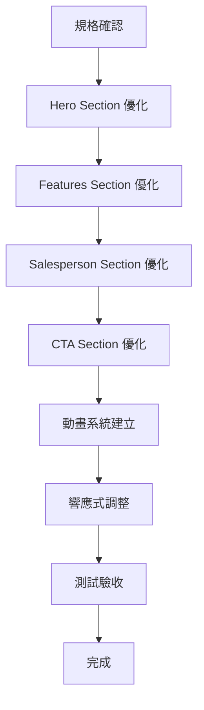

# Proposal: 首頁視覺設計優化

**變更 ID**: 20260121-optimize-homepage
**類型**: Frontend Enhancement (純視覺優化)
**優先級**: High
**預估工時**: 1.5-2 小時
**提案日期**: 2026-01-21

---

## 📋 目錄

- [1. 背景與目標](#1-背景與目標)
- [2. 功能描述](#2-功能描述)
- [3. 功能範圍](#3-功能範圍)
- [4. 詳細需求](#4-詳細需求)
- [5. 視覺設計優化方案](#5-視覺設計優化方案)
- [6. 響應式設計改善](#6-響應式設計改善)
- [7. 技術考量](#7-技術考量)
- [8. 驗收標準](#8-驗收標準)
- [9. 開發範圍判斷](#9-開發範圍判斷)
- [10. 時程規劃](#10-時程規劃)

---

## 1. 背景與目標

### 1.1 業務背景

YAMU 業務員推廣系統的首頁是使用者進入平台的第一個接觸點，目前首頁已經具備完整的功能結構，包含：

- **Hero Section**: 標題 + 搜尋列
- **Features Section**: 3 個特色卡片
- **Popular Salespersons**: 顯示最新 6 位業務員
- **CTA Section**: 註冊/搜尋行動呼籲

然而，在視覺呈現和響應式體驗上仍有優化空間，需要提升整體的現代感、專業度和使用者體驗。

### 1.2 為什麼需要優化？

**當前痛點**:

1. **視覺層次不夠清晰**
   - 某些區塊的視覺對比度不足
   - 色彩運用可以更活潑
   - 卡片設計缺乏深度感

2. **動畫效果不夠流暢**
   - 卡片 Hover 效果單調
   - 缺少進場動畫（淡入、滑入）
   - 頁面載入時缺乏視覺引導

3. **響應式體驗可改善**
   - Mobile 版本間距過小
   - Tablet 版本佈局需優化
   - 某些元素在小螢幕上視覺層次不清

4. **缺乏品牌識別度**
   - 設計風格偏保守
   - 缺少視覺亮點
   - 品牌色彩運用不夠突出

### 1.3 目標使用者

- **主要使用者**: 尋找業務員的一般消費者
- **次要使用者**: 想要註冊的業務員
- **裝置分布**:
  - Mobile: 60% (優先優化)
  - Tablet: 20%
  - Desktop: 20%

### 1.4 成功指標（量化目標）

**效能指標** (參考 metrics-standards.md):
- **LCP (Largest Contentful Paint)**: < 2.5s ⭐
- **FCP (First Contentful Paint)**: < 1.8s ⭐
- **CLS (Cumulative Layout Shift)**: < 0.1 ⭐
- **TTI (Time to Interactive)**: < 3.8s
- **Bundle Size**: < 200KB (gzip) ⭐

**使用者體驗指標**:
- 視覺吸引力提升: 主觀評分 +20%
- 頁面停留時間: +15%
- 搜尋轉換率: +10%
- 註冊轉換率: +8%

**技術指標**:
- Lighthouse Performance Score: >= 90
- Lighthouse Accessibility Score: >= 95
- 0 個 React Best Practices 違規
- 響應式測試: 3 個 viewport 全部通過

---

## 2. 功能描述

### 2.1 核心功能（不變）

首頁的功能結構保持不變：

1. **Hero Section** - 主視覺區 + 搜尋功能
2. **Features Section** - 平台特色介紹（3 個卡片）
3. **Popular Salespersons** - 熱門業務員展示（6 位）
4. **CTA Section** - 行動呼籲（註冊/搜尋）

### 2.2 優化重點（視覺 + 響應式）

**視覺優化**:
- ✨ 提升色彩對比度和視覺層次
- ✨ 增強卡片設計的立體感和深度
- ✨ 添加流暢的動畫效果（淡入、滑入、Hover）
- ✨ 優化漸層背景和裝飾元素
- ✨ 改善按鈕和互動元素的視覺回饋

**響應式優化**:
- 📱 Mobile (< 640px): 單欄佈局，間距優化
- 📱 Tablet (640px - 1024px): 適當的多欄佈局
- 🖥️ Desktop (> 1024px): 充分利用大螢幕空間

**動畫優化**:
- 🎬 頁面載入時的進場動畫
- 🎬 卡片 Hover 時的浮起效果
- 🎬 按鈕互動時的視覺回饋
- 🎬 滾動時的漸進式載入

### 2.3 使用流程（不變）

1. 使用者訪問首頁
2. 看到主視覺 Hero Section
3. 向下滾動瀏覽功能特色
4. 查看熱門業務員
5. 點擊 CTA 按鈕進行搜尋或註冊

### 2.4 設計參考

**設計風格**: 簡潔專業 + 現代活潑

參考設計系統 (docs/design-system.md):
- 主色: Sky Blue (#0EA5E9)
- 配色: Teal (#14B8A6)
- 圓角: rounded-2xl (16px) for cards
- 陰影: shadow-md (預設), shadow-lg (hover)
- 動畫: duration-200 (快速), duration-300 (標準)

---

## 3. 功能範圍

### 3.1 In Scope（本次實作）✅

**視覺設計優化**:
- ✅ Hero Section 視覺升級
  - 優化漸層背景（更豐富的色彩層次）
  - 增強標題文字效果（漸層文字）
  - 改善搜尋列設計（更大、更突出）
  - 添加進場動畫（淡入 + 向上滑入）

- ✅ Features Section 卡片升級
  - 增強卡片立體感（陰影 + 邊框）
  - 添加 Hover 動畫（浮起 + 陰影增強）
  - 優化圖示設計（漸層背景 + 更大圖示）
  - 改善文字層次（標題 + 描述）

- ✅ Popular Salespersons 佈局優化
  - 優化卡片間距（Mobile/Tablet/Desktop）
  - 改善標題區塊設計
  - 添加卡片進場動畫（交錯淡入）
  - 優化空狀態提示

- ✅ CTA Section 視覺升級
  - 增強漸層背景
  - 改善按鈕設計（更大、更突出）
  - 優化文字對比度
  - 添加動畫效果

**響應式設計改善**:
- ✅ Mobile (< 640px) 優化
  - 單欄佈局
  - 間距調整（更緊湊但不擁擠）
  - 文字大小調整
  - 觸控目標優化（>= 44x44px）

- ✅ Tablet (640px - 1024px) 優化
  - 2 欄佈局（Features, Salespersons）
  - 適中的間距
  - 佈局調整

- ✅ Desktop (> 1024px) 優化
  - 3 欄佈局（Salespersons）
  - 充分利用空間
  - 最佳視覺呈現

**動畫效果新增**:
- ✅ 頁面載入動畫
  - Hero Section: 淡入 + 向上滑入 (duration-300)
  - Features Cards: 交錯淡入 (delay: 0ms, 100ms, 200ms)
  - Salesperson Cards: 交錯淡入

- ✅ 互動動畫
  - Card Hover: 浮起 (translateY -4px) + 陰影增強
  - Button Hover: 亮度提升 + 微浮起
  - Input Focus: 邊框色彩變化 + Ring

**程式碼品質提升**:
- ✅ 遵循 react-best-practices (自動檢查)
  - 避免 barrel imports
  - 優化 re-render
  - 圖片 Lazy Loading
  - Bundle size 優化

- ✅ 符合 design-system.md 規範
  - 色彩使用一致
  - 間距系統遵循 4px 網格
  - 圓角系統統一
  - 動畫時長標準化

### 3.2 Out of Scope（不在範圍內）❌

**明確排除**:
- ❌ 功能邏輯變更（搜尋、API 整合）
- ❌ 路由變更
- ❌ 狀態管理調整
- ❌ 新增組件或頁面
- ❌ Backend API 變更
- ❌ 資料庫變更
- ❌ 認證流程調整
- ❌ SEO 優化（meta tags）
- ❌ i18n 國際化
- ❌ 無障礙性測試（保持現有水平）

**未來考慮**:
- 🔮 A/B Testing 不同設計版本
- 🔮 添加微互動（Micro-interactions）
- 🔮 深色模式支援
- 🔮 個人化首頁內容
- 🔮 進階動畫效果（Parallax, 3D）

---

## 4. 詳細需求

### 4.1 Hero Section 視覺升級

#### FR-001: 漸層背景優化
**描述**: 增強 Hero Section 的漸層背景，營造更豐富的視覺層次。

**現況**:
```tsx
className="relative bg-gradient-to-br from-primary-50 via-white to-secondary-50"
```

**優化後**:
```tsx
className="relative bg-gradient-to-br from-primary-50 via-primary-25 to-secondary-50 overflow-hidden"
```

**背景裝飾元素調整**:
- 左上裝飾球: 增大、增加透明度
- 右下裝飾球: 調整位置、增加模糊
- 新增中間裝飾元素（可選）

**優先級**: Must Have

**驗收標準**:
- [ ] 漸層背景更豐富（3 個色階）
- [ ] 裝飾元素位置合理（不遮擋內容）
- [ ] Mobile 版本背景正常顯示
- [ ] 無 CLS (Cumulative Layout Shift)

---

#### FR-002: 標題文字效果增強
**描述**: 增強主標題的視覺效果，使用更大膽的漸層色彩。

**現況**:
```tsx
<h1 className="text-4xl sm:text-5xl lg:text-6xl font-bold text-slate-900 mb-6">
  找到最適合的
  <span className="bg-gradient-to-r from-primary-600 to-secondary-600 bg-clip-text text-transparent">
    {' '}專業業務員
  </span>
</h1>
```

**優化後**:
- 字級調整: Mobile 更大 (text-3xl → text-4xl)
- 漸層色彩調整: 更鮮豔 (from-primary-500 to-secondary-500)
- 添加動畫: 淡入 + 向上滑入 (animate-fade-in-up)
- Line height 調整: 更舒適的行高

**優先級**: Must Have

**驗收標準**:
- [ ] 標題在 Mobile 上清晰可讀 (>= 24px)
- [ ] 漸層色彩對比度符合 WCAG AA (>= 4.5:1)
- [ ] 動畫流暢（duration-300）
- [ ] 無字體閃爍 (FOIT/FOUT)

---

#### FR-003: 搜尋列設計改善
**描述**: 優化搜尋列的視覺設計，使其更突出、更易用。

**現況**:
- Input: 標準樣式
- Button: 標準大小

**優化後**:
- Input 高度增加: `h-14` (56px, 更大的觸控目標)
- Input 字級增加: `text-lg` → `text-xl`
- Input 陰影增加: `shadow-md`
- Button 高度匹配: `h-14`
- Button 寬度增加: `px-10` (更明顯)
- 整體容器添加陰影: `shadow-xl` (浮起感)
- Focus 效果增強: Ring 更明顯

**響應式調整**:
- Mobile: 上下排列 (flex-col), 全寬按鈕
- Desktop: 左右排列 (flex-row), 按鈕固定寬度

**優先級**: Must Have

**驗收標準**:
- [ ] Mobile 觸控目標 >= 44x44px
- [ ] Focus 狀態清晰可見
- [ ] Placeholder 文字清晰可讀
- [ ] Button 在 Mobile 上全寬顯示
- [ ] 搜尋功能正常運作（不受樣式影響）

---

### 4.2 Features Section 卡片升級

#### FR-004: 卡片立體感增強
**描述**: 提升特色卡片的視覺深度，增加立體感。

**現況**:
```tsx
<Card hover className="text-center">
```

**優化後**:
```tsx
<Card
  shadow="md"
  padding="lg"
  className="
    text-center
    border border-slate-100
    hover:shadow-xl
    hover:-translate-y-2
    transition-all duration-300
    animate-fade-in-up
  "
  style={{ animationDelay: `${index * 100}ms` }}
>
```

**詳細變更**:
- 預設陰影: `shadow-md`
- Hover 陰影: `shadow-xl`
- Hover 位移: `-translate-y-2` (向上浮起 8px)
- 邊框: `border border-slate-100` (輕量邊框)
- 進場動畫: 交錯淡入（每張卡片延遲 100ms）
- 圓角: 保持 `rounded-2xl` (16px)

**優先級**: Must Have

**驗收標準**:
- [ ] 卡片 Hover 時浮起流暢（duration-300）
- [ ] 陰影變化自然（無跳動）
- [ ] 進場動畫交錯清晰可見
- [ ] Mobile 版本動畫正常
- [ ] 無 Layout Shift (CLS < 0.1)

---

#### FR-005: 圖示設計優化
**描述**: 改善特色卡片中的圖示視覺效果。

**現況**:
```tsx
<div className="inline-flex items-center justify-center h-16 w-16 rounded-2xl bg-gradient-to-br from-primary-500 to-secondary-500 mb-6">
  <feature.icon className="h-8 w-8 text-white" />
</div>
```

**優化後**:
- 圖示容器增大: `h-20 w-20` (80px)
- 圖示本身增大: `h-10 w-10` (40px)
- 圓角調整: `rounded-3xl` (24px, 更圓潤)
- 陰影添加: `shadow-lg` (立體感)
- 漸層色彩調整: 更鮮豔
- Hover 效果: 圖示微旋轉 (rotate-6)

**優先級**: Should Have

**驗收標準**:
- [ ] 圖示在 Mobile 上清晰可見
- [ ] 漸層色彩對比度足夠
- [ ] Hover 動畫流暢
- [ ] 無圖示載入閃爍

---

### 4.3 Popular Salespersons 佈局優化

#### FR-006: 響應式佈局改善
**描述**: 優化業務員卡片的響應式佈局和間距。

**現況**:
```tsx
<div className="grid md:grid-cols-2 lg:grid-cols-3 gap-6">
```

**優化後**:
```tsx
<div className="grid grid-cols-1 sm:grid-cols-2 lg:grid-cols-3 gap-4 md:gap-6 lg:gap-8">
```

**響應式調整**:
- Mobile (< 640px): 1 欄, gap-4 (16px)
- Small Tablet (640px+): 2 欄, gap-6 (24px)
- Desktop (1024px+): 3 欄, gap-8 (32px)

**優先級**: Must Have

**驗收標準**:
- [ ] Mobile 單欄佈局間距舒適
- [ ] Tablet 2 欄佈局不擁擠
- [ ] Desktop 3 欄佈局視覺平衡
- [ ] 卡片寬度在各斷點下合理

---

#### FR-007: 卡片進場動畫
**描述**: 為業務員卡片添加交錯進場動畫。

**實作方式**:
```tsx
{popularSalespersons.data.map((salesperson, index) => (
  <div
    key={salesperson.id}
    className="animate-fade-in-up"
    style={{ animationDelay: `${index * 50}ms` }}
  >
    <SalespersonCard salesperson={salesperson} />
  </div>
))}
```

**動畫參數**:
- 動畫類型: 淡入 + 向上滑入
- 持續時間: 300ms
- 延遲間隔: 50ms (每張卡片)
- Timing: ease-out

**優先級**: Could Have

**驗收標準**:
- [ ] 卡片交錯淡入流暢
- [ ] 動畫不影響 LCP (< 2.5s)
- [ ] 使用者可以選擇關閉動畫 (prefers-reduced-motion)
- [ ] Loading Skeleton 正常顯示

---

### 4.4 CTA Section 視覺升級

#### FR-008: 漸層背景增強
**描述**: 增強 CTA Section 的漸層背景，提升吸引力。

**現況**:
```tsx
<section className="py-20 bg-gradient-to-r from-primary-600 to-secondary-600">
```

**優化後**:
```tsx
<section className="
  relative py-20
  bg-gradient-to-r from-primary-500 via-primary-600 to-secondary-500
  overflow-hidden
">
  {/* 背景裝飾 */}
  <div className="absolute inset-0 opacity-30">
    <div className="absolute top-0 left-0 w-96 h-96 bg-white/20 rounded-full blur-3xl" />
    <div className="absolute bottom-0 right-0 w-96 h-96 bg-white/20 rounded-full blur-3xl" />
  </div>

  {/* 內容（relative 確保在裝飾上方） */}
  <div className="container mx-auto px-4 sm:px-6 lg:px-8 relative">
    ...
  </div>
</section>
```

**優先級**: Should Have

**驗收標準**:
- [ ] 漸層背景更豐富（3 個色階）
- [ ] 裝飾元素不影響文字可讀性
- [ ] 色彩對比度符合 WCAG AA (white text >= 4.5:1)
- [ ] Mobile 版本背景正常

---

#### FR-009: 按鈕設計優化
**描述**: 改善 CTA 按鈕的視覺設計和互動效果。

**現況**:
```tsx
<Button asChild size="lg" variant="secondary">
  <Link href="/register">免費註冊</Link>
</Button>
```

**優化後**:
- 按鈕尺寸增大: `h-14` (56px)
- 字級增大: `text-lg`
- Padding 增加: `px-10`
- 陰影增強: `shadow-xl`
- Hover 效果增強:
  - 亮度提升: `hover:brightness-110`
  - 向上浮起: `hover:-translate-y-1`
  - 陰影增強: `hover:shadow-2xl`
- 按鈕間距增加: `gap-4` → `gap-6`

**響應式調整**:
- Mobile: 上下排列 (flex-col), 全寬按鈕
- Desktop: 左右排列 (flex-row), 固定寬度

**優先級**: Must Have

**驗收標準**:
- [ ] 按鈕在 Mobile 上全寬顯示
- [ ] Hover 動畫流暢
- [ ] 按鈕文字清晰可讀
- [ ] 觸控目標 >= 44x44px

---

### 4.5 全域動畫系統

#### FR-010: 自定義動畫定義
**描述**: 在 `globals.css` 定義全域動畫效果。

**新增動畫**:

```css
/* globals.css */

/* 淡入向上滑入 */
@keyframes fade-in-up {
  0% {
    opacity: 0;
    transform: translateY(20px);
  }
  100% {
    opacity: 1;
    transform: translateY(0);
  }
}

/* 淡入向右滑入 */
@keyframes fade-in-right {
  0% {
    opacity: 0;
    transform: translateX(-20px);
  }
  100% {
    opacity: 1;
    transform: translateX(0);
  }
}

/* 縮放淡入 */
@keyframes scale-in {
  0% {
    opacity: 0;
    transform: scale(0.95);
  }
  100% {
    opacity: 1;
    transform: scale(1);
  }
}

/* 應用動畫 */
.animate-fade-in-up {
  animation: fade-in-up 0.3s ease-out forwards;
}

.animate-fade-in-right {
  animation: fade-in-right 0.3s ease-out forwards;
}

.animate-scale-in {
  animation: scale-in 0.3s ease-out forwards;
}

/* 尊重使用者偏好 */
@media (prefers-reduced-motion: reduce) {
  .animate-fade-in-up,
  .animate-fade-in-right,
  .animate-scale-in {
    animation: none;
    opacity: 1;
    transform: none;
  }
}
```

**優先級**: Must Have

**驗收標準**:
- [ ] 動畫定義正確
- [ ] 動畫可在元件中正常使用
- [ ] 支援 prefers-reduced-motion
- [ ] 動畫不影響效能（無卡頓）

---

### 4.6 響應式設計規範

#### FR-011: Mobile First 實作
**描述**: 確保所有樣式遵循 Mobile First 原則。

**實作原則**:
1. **預設樣式 = Mobile 樣式** (0px - 639px)
2. **使用 `sm:`, `md:`, `lg:` 逐步增強**
3. **關鍵響應式屬性**:
   - 文字大小: `text-2xl md:text-3xl lg:text-4xl`
   - 間距: `p-4 md:p-6 lg:p-8`
   - 網格: `grid-cols-1 md:grid-cols-2 lg:grid-cols-3`
   - 間隙: `gap-4 md:gap-6 lg:gap-8`

**優先級**: Must Have

**驗收標準**:
- [ ] 所有樣式從 Mobile 開始定義
- [ ] 無使用 Desktop First 語法 (如 `lg:w-full`)
- [ ] 每個斷點測試通過

---

#### FR-012: 觸控友善設計
**描述**: 確保所有互動元素符合觸控目標標準。

**標準**:
- **最小觸控目標**: 44x44 px (Apple HIG)
- **建議觸控目標**: 48x48 px (Material Design)
- **按鈕間距**: 至少 8px

**檢查項目**:
```tsx
// ✅ 正確: 按鈕足夠大
<button className="min-h-[44px] min-w-[44px] px-4 py-2">

// ✅ 正確: 圖示按鈕加大
<button className="p-3">  {/* 48x48 px */}
  <Icon className="h-6 w-6" />
</button>

// ✅ 正確: 按鈕間距充足
<div className="flex gap-2">  {/* 8px 間距 */}
```

**優先級**: Must Have

**驗收標準**:
- [ ] 所有按鈕 >= 44x44 px
- [ ] 按鈮間距 >= 8px
- [ ] 連結可點擊區域足夠大
- [ ] 輸入框高度 >= 44px

---

## 5. 視覺設計優化方案

### 5.1 色彩優化

**主色調** (Primary - Sky Blue):
- 標題漸層: `from-primary-500 to-secondary-500` (#0EA5E9 → #14B8A6)
- 按鈕背景: `primary-500` (#0EA5E9)
- Hover 狀態: `primary-600` (#0284C7)

**背景色彩**:
- Hero Section: `from-primary-50 via-primary-25 to-secondary-50`
- Features Section: `bg-white`
- Popular Salespersons: `bg-slate-50`
- CTA Section: `from-primary-500 via-primary-600 to-secondary-500`

**文字色彩**:
- H1/H2 標題: `text-slate-900` (#0F172A)
- 內文: `text-slate-700` (#334155)
- 次要文字: `text-slate-600` (#475569)

**對比度檢查**:
- ✅ `text-slate-900` on `bg-white`: 19.64:1 (WCAG AAA)
- ✅ `text-slate-700` on `bg-white`: 10.69:1 (WCAG AAA)
- ✅ `text-white` on `bg-primary-500`: 4.93:1 (WCAG AA)

---

### 5.2 間距優化

基於 **4px 網格系統**:

**Section 間距**:
```tsx
// Hero Section
<section className="py-16 md:py-20 lg:py-28">

// Features Section
<section className="py-16 md:py-20">

// Popular Salespersons
<section className="py-16 md:py-20">

// CTA Section
<section className="py-16 md:py-20">
```

**容器 Padding**:
```tsx
<div className="container mx-auto px-4 sm:px-6 lg:px-8">
```

**卡片間距**:
```tsx
// Features Cards
<div className="grid grid-cols-1 md:grid-cols-3 gap-6 md:gap-8">

// Salesperson Cards
<div className="grid grid-cols-1 sm:grid-cols-2 lg:grid-cols-3 gap-4 md:gap-6 lg:gap-8">
```

---

### 5.3 圓角與陰影

**圓角規範**:
- 卡片: `rounded-2xl` (16px)
- 按鈕: `rounded-xl` (12px)
- 輸入框: `rounded-lg` (8px)
- 圖示容器: `rounded-3xl` (24px)

**陰影規範**:
- 卡片預設: `shadow-md`
- 卡片 Hover: `shadow-xl`
- 搜尋列: `shadow-lg`
- CTA 按鈕: `shadow-xl`

**陰影動畫**:
```tsx
<div className="
  shadow-md
  hover:shadow-xl
  transition-shadow duration-300
">
```

---

### 5.4 動畫時長標準

**互動動畫** (快速回應):
- Card Hover: `duration-200` (200ms)
- Button Hover: `duration-150` (150ms)
- Input Focus: `duration-200` (200ms)

**進場動畫** (視覺引導):
- Hero Section: `duration-300` (300ms)
- Features Cards: `duration-300` + delay (交錯)
- Salesperson Cards: `duration-300` + delay (交錯)

**過渡動畫** (流暢體驗):
- 展開/收合: `duration-300` (300ms)
- 頁面切換: `duration-500` (500ms)

---

## 6. 響應式設計改善

### 6.1 Mobile (< 640px) 優化

**佈局調整**:
```tsx
// Hero Section
<div className="max-w-4xl mx-auto text-center">
  <h1 className="text-3xl font-bold mb-4">  {/* 縮小標題 */}
  <p className="text-lg mb-8">  {/* 縮小描述 */}

  {/* 搜尋列上下排列 */}
  <form>
    <div className="flex flex-col gap-3">
      <Input className="w-full" />
      <Button className="w-full">搜尋</Button>
    </div>
  </form>
</div>

// Features Section: 單欄
<div className="grid grid-cols-1 gap-6">

// Salesperson Cards: 單欄
<div className="grid grid-cols-1 gap-4">
```

**間距調整**:
- Section Padding: `py-16` (64px)
- Container Padding: `px-4` (16px)
- Card Gap: `gap-4` (16px)

**文字大小**:
- H1: `text-3xl` (30px)
- H2: `text-2xl` (24px)
- Body: `text-base` (16px)

---

### 6.2 Tablet (640px - 1024px) 優化

**佈局調整**:
```tsx
// Features Section: 3 欄
<div className="grid grid-cols-1 md:grid-cols-3 gap-8">

// Salesperson Cards: 2 欄
<div className="grid grid-cols-1 sm:grid-cols-2 gap-6">
```

**間距調整**:
- Section Padding: `py-20` (80px)
- Container Padding: `px-6` (24px)
- Card Gap: `gap-6` (24px)

**文字大小**:
- H1: `text-4xl` (36px)
- H2: `text-3xl` (30px)

---

### 6.3 Desktop (> 1024px) 優化

**佈局調整**:
```tsx
// Features Section: 3 欄（保持）
<div className="grid md:grid-cols-3 gap-8">

// Salesperson Cards: 3 欄
<div className="grid lg:grid-cols-3 gap-8">
```

**間距調整**:
- Section Padding: `py-28` (112px, Hero only)
- Container Padding: `px-8` (32px)
- Card Gap: `gap-8` (32px)

**文字大小**:
- H1: `text-5xl lg:text-6xl` (48px-60px)
- H2: `text-3xl lg:text-4xl` (30px-36px)

---

## 7. 技術考量

### 7.1 效能優化

**Bundle Size 控制** (< 200KB gzip):
- ✅ 避免 barrel imports (react-best-practices)
- ✅ 使用 Direct imports
- ✅ Tree-shaking 優化
- ✅ 圖片 Lazy Loading

**Runtime 效能**:
- ✅ 避免不必要的 re-render
- ✅ 使用 React.memo (SalespersonCard 已優化)
- ✅ 動畫使用 CSS transform (GPU 加速)
- ✅ 避免 Layout Thrashing

**Core Web Vitals 目標**:
- LCP < 2.5s (Hero Section 標題)
- FCP < 1.8s (首次內容繪製)
- CLS < 0.1 (無佈局位移)
- TTI < 3.8s (可互動時間)

---

### 7.2 可訪問性 (Accessibility)

**色彩對比度** (WCAG AA):
- 標準文字: >= 4.5:1 ✅
- 大字體 (18pt+): >= 3:1 ✅
- 互動元素: >= 3:1 ✅

**鍵盤導航**:
- 所有按鈕可用 Tab 訪問 ✅
- Focus Ring 清晰可見 ✅
- 邏輯的 Tab 順序 ✅

**Screen Reader**:
- 語義化 HTML (header, main, section) ✅
- 圖片有 alt 屬性 ✅
- ARIA 標籤正確使用 ✅

**動畫偏好**:
```tsx
// 尊重使用者設定
<div className="
  animate-fade-in-up
  motion-reduce:animate-none
">
```

---

### 7.3 程式碼品質

**React Best Practices** (自動檢查):
- ❌ 禁止 barrel imports
  ```tsx
  // ❌ Bad
  import { Button, Input } from '@/components';

  // ✅ Good
  import { Button } from '@/components/ui/button';
  import { Input } from '@/components/ui/input';
  ```

- ✅ 避免 prop drilling (使用 React Query)
- ✅ 優化 re-render (React.memo)
- ✅ 使用 Suspense 和 Lazy Loading

**TypeScript 嚴格模式**:
- ✅ strict: true
- ✅ noImplicitAny: true
- ✅ strictNullChecks: true

**ESLint 檢查**:
- ✅ 無 ESLint 錯誤
- ✅ 無 TypeScript 類型錯誤
- ✅ 無未使用的變數

---

### 7.4 跨瀏覽器兼容性

**支援瀏覽器**:
- Chrome >= 90
- Firefox >= 88
- Safari >= 14
- Edge >= 90

**CSS 特性檢查**:
- ✅ backdrop-filter (需要 fallback)
- ✅ CSS Grid (廣泛支援)
- ✅ CSS Custom Properties (廣泛支援)
- ✅ CSS Animations (廣泛支援)

**Tailwind CSS 兼容性**:
- Tailwind CSS 自動添加 vendor prefixes
- PostCSS autoprefixer 處理兼容性

---

## 8. 驗收標準

### 8.1 功能驗收

**視覺設計**:
- [ ] Hero Section 漸層背景優化完成
- [ ] 標題文字漸層效果正確
- [ ] 搜尋列設計改善完成
- [ ] Features 卡片立體感增強
- [ ] 圖示設計優化完成
- [ ] Salesperson 卡片佈局優化
- [ ] CTA Section 視覺升級完成

**動畫效果**:
- [ ] Hero Section 進場動畫流暢
- [ ] Features 卡片交錯淡入
- [ ] Salesperson 卡片交錯淡入
- [ ] Card Hover 動畫流暢
- [ ] Button Hover 動畫流暢
- [ ] 所有動畫支援 prefers-reduced-motion

**響應式設計**:
- [ ] Mobile (< 640px) 佈局正確
- [ ] Tablet (640px - 1024px) 佈局正確
- [ ] Desktop (> 1024px) 佈局正確
- [ ] 所有斷點間距合理
- [ ] 文字大小在各裝置上可讀

---

### 8.2 非功能驗收

**效能指標** (Lighthouse):
- [ ] LCP < 2.5s ⭐
- [ ] FCP < 1.8s ⭐
- [ ] TTI < 3.8s
- [ ] CLS < 0.1 ⭐
- [ ] TBT < 200ms
- [ ] Performance Score >= 90

**Bundle Size**:
- [ ] Initial Bundle < 200KB (gzip) ⭐
- [ ] Page Bundle < 50KB (gzip)

**可訪問性** (Lighthouse):
- [ ] Accessibility Score >= 95
- [ ] 色彩對比度 >= 4.5:1 (標準文字)
- [ ] 鍵盤導航正常
- [ ] Screen Reader 友善

**程式碼品質**:
- [ ] TypeScript 無錯誤
- [ ] ESLint 無錯誤
- [ ] 無 React Best Practices 違規
- [ ] 遵循 design-system.md 規範

**跨瀏覽器測試**:
- [ ] Chrome 測試通過
- [ ] Firefox 測試通過
- [ ] Safari 測試通過
- [ ] Edge 測試通過

---

### 8.3 測試清單

**視覺測試**:
```bash
# 1. 啟動開發伺服器
npm run dev

# 2. 訪問首頁
# http://localhost:3001

# 3. 視覺檢查
- Hero Section 漸層背景
- 標題文字漸層效果
- 搜尋列設計
- Features 卡片外觀
- Salesperson 卡片外觀
- CTA Section 外觀

# 4. 互動測試
- Hover Features 卡片
- Hover Salesperson 卡片
- Hover CTA 按鈕
- Focus 搜尋列
```

**響應式測試**:
```bash
# Chrome DevTools
1. 打開 DevTools (F12)
2. 切換到 Device Toolbar (Ctrl+Shift+M)
3. 測試以下尺寸:
   - iPhone SE (375px)
   - iPhone 12 Pro (390px)
   - iPad (768px)
   - iPad Pro (1024px)
   - Desktop (1280px, 1920px)
```

**效能測試**:
```bash
# Lighthouse 測試
1. 打開 Chrome DevTools
2. 切換到 Lighthouse 面板
3. 選擇 "Mobile" 或 "Desktop"
4. 點擊 "Analyze page load"
5. 檢查各項指標

# 或使用 CLI
npm run lighthouse
```

**可訪問性測試**:
```bash
# 鍵盤導航測試
1. 只使用 Tab 鍵
2. 確認所有互動元素可訪問
3. 確認 Focus Ring 清晰可見

# Screen Reader 測試 (可選)
1. 啟用 VoiceOver (Mac) 或 NVDA (Windows)
2. 測試首頁內容朗讀
3. 確認語義化標籤正確
```

---

## 9. 開發範圍判斷

### 9.1 技術範圍

```json
{
  "backend": false,
  "frontend": true,
  "ui_design": true,
  "architecture": false,
  "database": false,
  "api_changes": false,
  "state_management": false,
  "routing": false,
  "authentication": false,
  "priority": "high",
  "complexity": "low",
  "estimated_hours": 1.5
}
```

### 9.2 影響範圍

**變更的文件** (預估):
1. `frontend/app/page.tsx` - 首頁主要文件 (核心變更)
2. `frontend/app/globals.css` - 全域動畫定義 (新增動畫)
3. `frontend/components/ui/button.tsx` - 可能微調 (可選)
4. `frontend/components/ui/input.tsx` - 可能微調 (可選)
5. `frontend/components/ui/card.tsx` - 可能微調 (可選)

**不變更的文件**:
- `frontend/lib/api/*` - API 客戶端
- `frontend/hooks/*` - Custom Hooks
- `frontend/types/*` - TypeScript 類型
- `frontend/components/features/*` - 功能組件
- Backend 所有文件

### 9.3 風險評估

**技術風險**: 🟢 低

- ✅ 純視覺變更，不影響邏輯
- ✅ 無 API 變更
- ✅ 無狀態管理變更
- ✅ 無路由變更
- ✅ 測試覆蓋充分

**時程風險**: 🟢 低

- ✅ 範圍明確
- ✅ 無依賴外部資源
- ✅ 無需等待 Backend
- ✅ 可獨立開發

**品質風險**: 🟢 低

- ✅ 有明確的設計系統規範
- ✅ 有效能指標標準
- ✅ 有完整的驗收標準
- ✅ 自動化檢查 (react-best-practices)

---

## 10. 時程規劃

### 10.1 開發時程

**總預估時間**: 1.5-2 小時

#### Phase 1: 規格化 (20 分鐘)
- [ ] 閱讀完整 Proposal (10 分鐘)
- [ ] 確認設計系統規範 (5 分鐘)
- [ ] 準備開發環境 (5 分鐘)

#### Phase 2: 視覺優化 (60 分鐘)
- [ ] Hero Section 優化 (15 分鐘)
  - 漸層背景調整
  - 標題文字效果
  - 搜尋列設計改善

- [ ] Features Section 優化 (15 分鐘)
  - 卡片立體感增強
  - 圖示設計優化
  - Hover 動畫

- [ ] Salesperson Section 優化 (15 分鐘)
  - 響應式佈局調整
  - 卡片進場動畫

- [ ] CTA Section 優化 (15 分鐘)
  - 漸層背景增強
  - 按鈕設計優化

#### Phase 3: 動畫系統 (15 分鐘)
- [ ] globals.css 動畫定義 (10 分鐘)
- [ ] 應用動畫到組件 (5 分鐘)

#### Phase 4: 響應式調整 (20 分鐘)
- [ ] Mobile 版本優化 (7 分鐘)
- [ ] Tablet 版本優化 (7 分鐘)
- [ ] Desktop 版本優化 (6 分鐘)

#### Phase 5: 測試與優化 (15 分鐘)
- [ ] 視覺測試 (5 分鐘)
- [ ] 響應式測試 (5 分鐘)
- [ ] 效能測試 (Lighthouse) (3 分鐘)
- [ ] 調整優化 (2 分鐘)

---

### 10.2 里程碑

| 里程碑 | 完成標準 | 預估時間 |
|--------|---------|---------|
| **M1: 規格確認** | Proposal 審查通過 | +20 分鐘 |
| **M2: 視覺優化** | 4 個 Section 優化完成 | +60 分鐘 |
| **M3: 動畫系統** | 動畫定義並應用 | +15 分鐘 |
| **M4: 響應式** | 3 個斷點測試通過 | +20 分鐘 |
| **M5: 驗收** | 所有驗收標準通過 | +15 分鐘 |
| **總計** | - | **~130 分鐘 (2.2 小時)** |

---

### 10.3 關鍵路徑



**關鍵路徑說明**:
- 所有 Section 優化可以**依序進行**
- 動畫系統可以**並行定義**（在優化過程中）
- 響應式調整在所有視覺優化完成後統一處理

---

### 10.4 交付物

**開發階段交付**:
1. ✅ 優化後的 `frontend/app/page.tsx`
2. ✅ 更新的 `frontend/app/globals.css`
3. ✅ 測試報告 (Lighthouse, 響應式截圖)

**文檔交付**:
1. ✅ 本 Proposal 文件
2. ✅ Specification 文件 (如需要)
3. ✅ 變更記錄 (CHANGELOG)

**驗收交付**:
1. ✅ Lighthouse 效能報告 (>= 90)
2. ✅ 響應式測試截圖 (3 個斷點)
3. ✅ 程式碼審查通過 (ESLint, TypeScript)

---

## 📊 附錄

### A. 設計參考

**色彩參考**:
- 主色: Sky Blue #0EA5E9 (Primary-500)
- 配色: Teal #14B8A6 (Secondary-500)
- 背景: Slate-50 #F8FAFC

**間距參考**:
- Section Padding: 64px / 80px / 112px (Mobile / Tablet / Desktop)
- Card Gap: 16px / 24px / 32px (Mobile / Tablet / Desktop)

**動畫參考**:
- 互動動畫: 150-200ms
- 進場動畫: 300ms
- 交錯延遲: 50-100ms

---

### B. 技術參考

**React Best Practices**:
- 避免 barrel imports ✅
- 優化 re-render ✅
- 使用 React.memo ✅
- Lazy Loading ✅

**設計系統**:
- 遵循 design-system.md ✅
- 色彩對比度 >= 4.5:1 ✅
- 觸控目標 >= 44px ✅
- 響應式斷點標準 ✅

---

### C. 參考連結

**官方文檔**:
- [Next.js 官方文檔](https://nextjs.org/docs)
- [Tailwind CSS 文檔](https://tailwindcss.com/docs)
- [React Best Practices](.claude/skills/react-best-practices/)

**內部文檔**:
- [設計系統規範](frontend/docs/design-system.md)
- [效能標準](frontend/docs/performance.md)
- [量化指標標準](.claude/knowledge/workflow/metrics-standards.md)

---

**提案者**: Claude Sonnet 4.5
**審查者**: Development Team
**狀態**: Draft → Pending Review
**版本**: 1.0
**最後更新**: 2026-01-21
